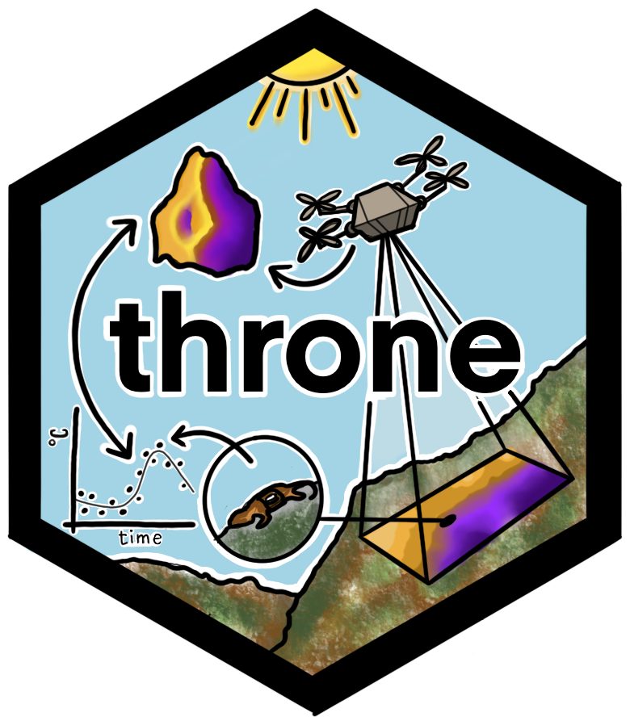

# `throne`: Using aerial thermography to map terrestrial thermal environments in unprecedented detail 

Accurately quantifying and mapping thermal environments is crucial to predict 
how environmental change is going to impact organisms. However, describing thermal
environments is challenging due to the mismatch between the resolution of available data 
and the scale at which organisms experience thermal variation. Here, we present
the `throne` package, which provides tools to combine spatially discrete but temporally
complete measurements from temperature loggers with spatially complete but temporally 
discrete thermal maps obtained via TIR drone photogrammetry to produce spatio-temporally
complete thermal landscapes. 

## Getting started

The package is currently under development and not yet available on CRAN, but it 
can be downloaded directly from GitHub via:

```R
 devtools::install_github("ggcostoya/throne")
```

For an overview of how the `throne` works please visit [this page](https://ggcostoya.github.io/throne/articles/overview.html)

## How to cite the package

This package accompanies a [study in *Methods in Ecology & Evolution*](https://besjournals.onlinelibrary.wiley.com/doi/10.1111/2041-210X.70096):

  Alujević, K., Garcia-Costoya, G., Ratia, N., Schmitz, E., Godkin, R. S., Gopal, A. C., 
  Bujan, J., & Logan, M. L. (2025). Using aerial thermography to map terrestrial thermal 
  environments in unprecedented detail. Methods in Ecology and Evolution, 
  16, 1688–1702. https://doi.org/10.1111/2041-210X.70096

If you use `throne` in your software, please cite the package as:

  Alujević K, Garcia-Costoya G, Ratia N, Schmitz E, Godkin R, Bujan J, Gopal A, 
  Logan M (2024). throne: Predicting thermal landscapes in spatio-temporally 
  unprecedented detail. R package version 1.0, https://ggcostoya.github.io/throne/.

## Contact 

For questions, suggestions, or bug reports, please open an issue on GitHub or contact

  - [Guillermo Garcia Costoya](mailto:ggarciacosto@gmail.com)
