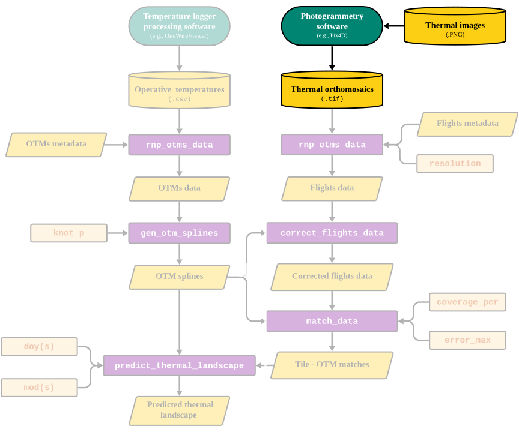

```{r setup, include=FALSE}
knitr::opts_chunk$set(echo = TRUE)
```

# Overview

The goal of this vignette is to illustrate the first step of the workflow presented in the `throne` package which is the acquisition of thermal photogrammetry data. To do this, we will need to 1) acquire a drone with a mounted IR thermal imaging camera, 2) fly the drone to collect thermal images, and 3) process the thermal images using a photogrammetry software to obtain a thermal orthomosaic of a flight (i.e., a `.tif` format file). Here we provide instructions on how to perform each of these steps and we include links to recommended drones, software and tutorials to complement them.

```{r, echo=FALSE, out.width = '80%', fig.align = 'center', fig.cap = "Figure 1. Part of the workflow covered in this vignette"}

```

# Acquiring a thermal imaging drone

Unmanned aerial vehicles (UAVs), colloquially known as “drones”, are rapidly becoming cheaper and more accessible to use. Drones come in all shapes and sizes, from first-person view (FPV) miniature racing quadcopters, to large payload-carrying hexcopters. Hobbyists can purchase and fly smaller drones for recreational purposes for less than \$500 (such as the [DJI Mini SE 2] (<https://www.dji.com/mini-2-se>)), while a drone that is used for commercial (or research) purposes may require higher specifications (up to \$5000+). For example, more expensive drones typically come with more accurate on-board geolocation systems (GNSS or RTK modules), better in-flight stabilization systems for accurate photography, batteries with higher capacity, obstacle detection sensors, and stronger protection against the elements (rain, heat, dust etc.). More importantly, higher-quality drones are designed to reliably carry expensive camera equipment, such as high-resolution visual (RGB) cameras for topography models, near-infrared cameras for mapping vegetation, or infrared cameras (such as FLIR cameras, developed by Teledyne Systems) to build thermal landscape models.

When choosing a drone equipped with an infrared camera (“thermal drone”), it is important to note that the camera is typically paired with a particular drone model. Different drones have different gimbal (camera) mounting systems, which means that the cameras themselves are rarely interchangeable. It is also important to note that the paired thermal cameras are typically as expensive - if not more expensive - as the drone itself. The price of the thermal camera is typically determined by its accuracy and resolution (rarely exceeding 640x512 pixels - considerably lower than RGB cameras). Purchasing a thermal drone should therefore be considered an investment that should last for many years for anyone interested in conducting high-resolution thermal research.

Currently, DJI Enterprises dominates the market with many drone options capable of being equipped with thermal cameras. The [DJI Mavic 3T](https://enterprise.dji.com/mavic-3-enterprise) is the thermal variant of the commonly used DJI Mavic 3 drone, and costs approximately \$5,000. In the higher end of the spectrum, for approximately \$9,000, DJI also sells the [Matrice 30T](https://enterprise.dji.com/matrice-30) which is much more rugged, boasts a more accurate on-board positioning system, is equipped with higher-resolution cameras, and overall designed to chart larger, more remote areas. Finally, there is a fairly large market of used drones, that can be an option if budget is a concern. A used [DJI Matrice 200 v2](https://www.dji.com/matrice-200-series-v2) (the model we use, equipped with a [Zenmuse XT2 camera](https://www.dji.com/support/product/zenmuse-xt2)), can in 2024 be purchased for approximately \$2,000. Overall, how often we intend to use the drone, and the environmental conditions of our field site are key factors to consider when choosing what to buy. The specifications required to accurately survey our study site will largely depend on the spatial scale of which we wish to predict the thermal landscape.

## Flying drones and collecting thermal imagery

Once you have acquired a drone with a thermal camera, the next step is to fly the drone to collect thermal images.Commonly, all thermal imaging drones will come with a mission (i.e., flight plan) setting software. In our case, we used [DJI Pilot](https://www.dji.com/downloads/djiapp/dji-pilot) which comes with our drone model, and with an online detailed training course tutorials on [how to set up flights online](https://www.youtube.com/playlist?list=PLQMMtJkQxywvYliYTEjdrgv8NTrXARiAblink). Since each software will be different, we won't provide a tutorial for each but rather we will give some general guidelines on how to conduct missions such that they work as optimally as possible with the software developed for `throne`. Naturally, flight mission details will depend on the UAV's and camera setup, but generally speaking, standard mission planning etiquette applies to collecting data for use within `throne`:

1.  Abide by all local laws and regulations regarding flight altitude, airspace restrictions and drone registration requirements. Check with local authorities what applies in the area of study. For example, if flying in U.S. airspace, adhere to the **Code of Federal Regulations (CFR) Part 107**, and make the flights take place in Class G airspace, unless given explicit permission to fly elsewhere. If used for research purposes, the drone might also need to be registered for commercial use.

2.  The default drone flight path ("zig-zag line") is generally fine for most purposes. We recommend avoiding long, narrow flight paths to minimize banding issues (differences between long “strips” of photos), and that users aim to keep flight times as short as possible to make sure that all images are collected within a relatively short span and thus can capture the same thermal conditions.

3.  Fly under weather conditions that are typical to the study system of interest.

4.  We recommend distributing flights across different days and across different times of the day, to maximize representation of daily fluctuations in temperature

5.  To avoid stitching issues, we recommend flying over a larger area than your area of interest.

An important aspect to consider when planning a flight mission is also the resolution of the mounted thermal imaging camera. Usually, thermal imaging cameras have a much lower resolution and field of view than visual cameras (RGB). Therefore, make sure that the vertical and horizontal photo overlap ratio is set high (preferably 90%/90% in either direction, i.e., any given photo’s coverage only differs by 10% compared to the previous), as well as maintain a relatively high flight altitude (300 ft / 90 m). This, of course, depends on the spatial scale of the studied landscape and the desired resolution thereof. Regardless,we strongly encourage to make sure that missions are built around the *thermal* camera's field of view rather than the visual camera - especially if flying above rugged terrain- otherwise we risk running into stitching issues when processing the photos, (see following sections) It's generally a good idea to extend the flight mission area to exceed the study site's boundaries by a few meters to compensate for this difference.

```{r, echo=FALSE, out.width = '80%', fig.align = 'center', fig.cap = "Figure 1. The field of view is typically smaller for thermal cameras compared to visual cameras. This overlay - while not perfect - aims to show the difference between a visual and thermal photo taken right after one another, to illustrate the difference in the area covered"}
knitr::include_graphics("images/drone_setup_thermal_overlap.png")
```

A final very important factor to consider are the potential geolocation errors of the thermal images . While some of this can be compensated through post-processing, deploying **ground control points (GCPs)** is one of the more common methods that can be used as a preventative measure to accurately georeference flight missions. Ground control points are GPS-tagged landmarks that allow us to pinpoint the exact location of our field site in relation to our photos, in addition to properly scaling our spatial models. We recommend deploying a minimum of three GCPs per field site that you aim to survey - simple black-and-white square tiles that have known, high-accuracy GPS locations works just fine - but it is crucial that these are deployed **before** any flights are conducted so that they are visible in photos from each mission. GCPs should ideally be placed along the borders of your study site (to properly “frame” the extent of our model), while simultaneously encompassing the topographical complexity of the study site. For example, if you’re surveying a flat landscape with a few scattered rocky outcrops, it might be a good idea to place a few GCPs along the border of the field site; a few within on flat ground; and finally a couple on top of the outcrops. This way, we have multiple reference points in the landscape that minimize the risk of any future processing issues. Keep in mind that the accuracy of the GCP locations are only as accurate as the GPS unit used to record their location with. For minimal geo-referencing errors, we therefore recommend a higher-end handheld GNSS system, such as those developed by [Trimble](https://geospatial.trimble.com/en/products/hardware/gnss-systems). For more information on GCPs, PIX4D has a [great article](https://www.pix4d.com/blog/GCP-accuracy-drone-maps/) on how they correlate with the accuracy of drone maps.

```{r, echo=FALSE, out.width = '80%', fig.align = 'center', fig.cap = "Figure 2. When using ground control points (GCPs) for missims, it is important that they are visible across all flights"}
knitr::include_graphics("images/drone_setup_gcp_nadir.png")
```

# Processing thermal imagery data

Having collected your thermal images across multiple flights, the next step is to use a photogrammetry software to produce *thermal orthomosaic* images, which will be the source of the `R` workflow of the `throne` package. We can think of a thermal orthomosaic image as an assembled jigsaw puzzle: each puzzle piece is a thermal image taken by our drone, and the processing software puts them all together (through a process called photogrammetry), while making sure any distortion between the images is accounted for. When we have constructed a thermal orthomosaic, we have essentially combined all the individual images taken by our drone into a single “snapshot” of the thermal landscape - ready for use with ‘throne’. There are plenty of photogrammetry software capable of producing orthomosaic images from drone imagery, and each comes with its own set of pros and cons. We use [PIX4Dmapper](https://www.pix4d.com/product/pix4dmapper-photogrammetry-software/), yet this software might not be accessible for everyone. [OpenDroneMap](https://www.opendronemap.org/) offers a web-based, open-source and free solution, which we won't cover here, yet might be a valuable option for some users. Note also that PIX4D has a plethora of resources available online on how to use the software (such as ["how-to" videos](https://support.pix4d.com/hc/en-us/articles/360032118251-Video-tutorials#PIX4Dmapper) and [articles](https://support.pix4d.com/hc/en-us/categories/360001503192)), ranging from how to load images to editing raster images which we strongly recommend users follow. Regardless, when processing thermal images using PIX4Dmapper, we recommend the following steps:

1.  Create a project by clicking "New Project" under "File".

2.  Navigate to the folder where you wish the project folder to be saved. We recommend saving the project in the same folder as the flight images, assuming the images are sorted by flight mission.

3.  Select all images (RGB **and** thermal) from the flight mission, and only photos that are relevant to that specific flight.

4.  When prompted, select the *Thermal Camera* default processing template. This should be visible in the menu after adding and loading the photos to the project. For more information, see PIX4D's article [Processing Options Default Templates](https://support.pix4d.com/hc/en-us/articles/205319155-Processing-Options-Default-Templates#gsc.tab=0)

5.  Ensure that the "Pixel Size" and the "Focal Length" values are correctly set for your camera model: on the menu bar, click Project \> Image Properties Editor... and in the section Selected Camera Model, click Edit... For step-by-step instructions about how to modify the camera model, refer to PIX4D's article [How to use the Editing Camera Model Options](https://support.pix4d.com/hc/en-us/articles/202560169).

6.  Before starting the processing, open "Processing Options" and navigate to *Keypoints Image Scale* under "Initial Processing" and set it to “Full”; navigate to "Point Cloud and Mesh" and the Point Cloud and set the *Image Scale* to 1 (original). These settings increase the density of keypoints and the resolution of the final product, at the cost of processing time (the values can be left unchanged, but note that the quality of subsequent processing steps in `R` will be affected). If desired, we can save this as a custom template for future `throne` flight processes, by clicking "Save Template".

7.  If we do not wish to use (or don't have access to any) ground control points, go ahead and click "Start" on the Processing bar to begin processing your images. The thermal landscape map will be generated during the final step, "3. DSM, Orthomosaic, and Index.". Processing time depends on the specifications of the PC used and the size of the project, but usually lasts a couple of hours. WeYou can adjust the resources (GB of RAM and CPU threads) that PIX4Dmapper will use under "Processing options". Note that the default is to use **all** the PC's available resources.

```{r, echo=FALSE, out.width = '80%', fig.align = 'center', fig.cap = "Figure 3. How to create and start processing a project in Pix4Dmapper"}
knitr::include_graphics("images/drone_setup_pix4D.gif")
```

## Note on GCPs while processing thermal imagery

If ground control points are used in a project within Pix4D mapper, make sure to import them before starting the processing. PIX4D has [a extensive how-to guides](https://support.pix4d.com/hc/en-us/articles/202558699-Using-GCPs-PIX4Dmapper) on this topic, which applies to generating raster images for `throne` as well. Below is some general advice:

-   In PIX4Dmapper, the easiest way to import ground control points is by loading a .csv-file that contains the latitude, longitude and altitude of your GCPs, using the "GCP/MTP Manager" after the first processing step ("Initial Processing") has been completed. Make sure the GCPs and the project have the same coordinate system.

-   After loading the GCP points, they will appear as "pins" in your point cloud, visible in the rayCloud viewer.

-   Manually match photos with the GCPs in which they are visible using the rayCloud editor. Refer to the [PIX4D documentation](https://support.pix4d.com/hc/en-us/articles/360000276046-How-to-import-and-mark-ground-control-points-GCPs-PIX4Dmapper) for more information.

-   Continue by selecting "Reoptimize" your project, under the "Process" drop-down menu and continue with the second and third processing steps.

-   If using a DJI drone, we may encounter issues when importing the GCP coordinates from their .csv-file. If that is the case, *first* manually create tie points where the GCPs are marked the GCPs in multiple photos (with identical names to their labels in the .csv-file) and *then* import the coordinates using the "GCP/MTP Manager". Finish by clicking "Rematch and Optimize", under the "Process" drop down menu.

```{r, echo=FALSE, out.width = '80%', fig.align = 'center', fig.cap = "Figure 4. Ground control points (GCPs) will show as blue/green markers in the rayCloud editor once they have been loaded and optimized with the point cloud"}
knitr::include_graphics("images/drone_setup_gcp_example.png")
```

PIX4D will automatically create sub folders for each processing step of your project, contained in its main folder that you specified the directory for when loading in photos. The final thermal orthomosaic image can be found under the project's subfolder named "3_dsm_ortho/2_mosaic". There should be two .tif-files in the folder. Extract the one that is **not** the visual orthomosaic (i.e. non-black-and-white image) and export it to the directory where it can be used in subsequent processing steps within the `R` workflow of `throne`.
