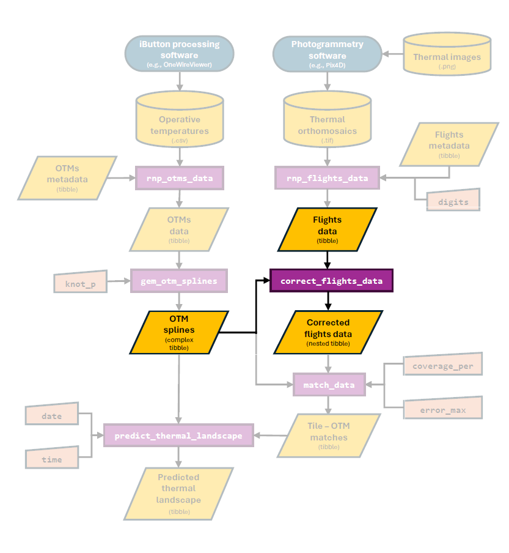

```{r setup, include=FALSE}
knitr::opts_chunk$set(echo = TRUE)
devtools::load_all()
```

# Overview

In this vignette, our aim is to illustrate how to correct temperature data obtained using thermal photogrammetry. By correcting, we are referring to the process of transforming the temperature measurements made via the IR cameras mounted into the drone into **operative temperatures** as measured using an **operative temperature model** (OTM). Below we highlight the section of the package's workflow that is covered in this vignette:

```{r, echo=FALSE, out.width = '80%', fig.align = 'center'}

```

The need from this correction stems from the fundamental difference between temperature estimates made using an IR camera and those made by making physical contact with an object. This is because the IR camera measurement is influenced by a wide range of factors including the object's emissivity, the conditions in which the image is taken (ambient temperature, amount of light etc. see [Playà-Montmany & Tattersall 2021](https://besjournals.onlinelibrary.wiley.com/doi/full/10.1111/2041-210X.13563) for further details).

In contrast, OTMs are designed to record temperature measurements that match the internal body temperature of the organism as closely as possible. This is achieved by enclosing a temperature logger (e.g., an iButton) inside of a structure of a similar size and with similar surface properties to the the organism of interest. This methodology has been used extensively in the field of thermal ecology and recent advances have minimized the costs of production and maximized the accuracy of OTMs (see our past work in [Alujević et al. 2024](https://www.sciencedirect.com/science/article/pii/S0306456523003030%5D)).

Due to the above, the IR camera of the drone and the OTM will ultimately record fundamentally different temperature metrics. For the thermal measurements estimated using the drone to be truly representative of what the organism is experiencing, they must be corrected such that they instead describe operative temperatures.

# The `correct_flights_data` function

To transform temperature measurements obtained using a drone-mounted IR camera into operative temperature measurements, the `throne` package includes the `correct_flights_data` function. This function will perform a double correction on data obtained through a flight by correcting for 1) differences in light conditions across multiple flights and 2) the inherent difference in physical properties between IR and operative temperature measurements.To perform such correction, the function will take 2 inputs:

1. A `flights_data` `tibble` obtained through the `rnp_flights_data` function like the one below:

```{r}
flights_data
```

2. An `otm_splines` complex `tibble` obtained through the `generate_otm_splines` function like the one seen below:

```{r}
otms_splines
```

Both data sets contain `latitude` and `longitude` information. This is a crucial step for the correction process, as the first task will be to filter the `flights_data` to contain only tiles (i.e., unique `latitude` and `longitude` combinations) where OTMs were actually deployed. 

Once these tiles are filtered, we will then use the spline models to estimate the temperature of each OTM at the exact `year`, day of the year (`doy`) and minute of the day (`mod`) at which each of the flights took place. The result will be a `tibble` where each unique `latitude` & `longitude` in each unique `year`, `doy` and `mod` has an IR temperature measurement (`ir_temp`, from the drone) associated with an operative temperature measurement (`op_temp`, from the OTM) as seen below: 

```{r}
correction_data
```

> The `tibble` above contains the `mod_start` and `mod_end` columns. These are the `mod` when the flight started and when the flight ended. In the example data, all flights were relatively fast (~ 4 minutes) but to cover larger areas flights are going to be longer. In that case, the predicted operative temperature (`op_temp`) for that OTM on that tile is the average temperature for the duration of the flight. 

Using this data we can visualize the need for a correction:

```{r, message = FALSE, echo = FALSE, fig.align='center'}
correction_data %>% 
  ggplot(aes(x = op_temp, y = ir_temp, col = mod_start)) +
  geom_point(size = 2, alpha = 0.5) +
  geom_abline(intercept = 0, slope = 1, col = "gray", linewidth = 2) +
  geom_smooth(method = "lm", col = "black") +
  scale_color_gradient2(low = "black", mid = "orange", high = "darkblue",midpoint = 12*60) +
  xlab("Operative Temperature (°C)") +
  ylab("IR Temperature (°C)") +
  theme_minimal() +
  theme(axis.line = element_line(),
        axis.ticks = element_line()) +
  labs(colour = "MOD")
```

As shown above, there is a consistent bias between these two measurements, with IR temperatures being generally cooler than operative temperatures when both have high values and the opposite holding true when both have low values. Note that the line of best linear fit is substantially different from the gray line that indicates the ideal 1:1 relationship. This can be easily appreciated when running a simple linear regression between `ir_temp` and `op_temp`.

```{r}
summary(lm(ir_temp ~ op_temp, data = correction_data))
```

The `(Intercept)` and the slope (i.e., the `Estimate` of `op_temp` above) are `6.23` and `0.75`  when, ideally, we would want them to be at `0` and `1` respectively. Further the $R^2$ (`R-squared` in the model's output) of this relationship is `0.625`, for an improved match between these two measurements we would also want $R^2$ to be closer to `1`. 

It is in this step when we implement the first correction, that has to do with the date and time of each flight. Because flights took place at different days and in different `mod` both the environmental temperature and the light conditions where variable. We can visualize how the bias between measurements (i.e., `op_temp` - `ir_temp`) is different depending on the `mod`. 

```{r, echo = FALSE, message=FALSE, fig.align='center'}
correction_data %>% 
  ggplot(aes(x = mod_start, y = op_temp - ir_temp, col = mod_start)) +
  geom_jitter(height = 0, width = 1, size = 2, alpha = 0.5) +
  geom_hline(yintercept = 0, linewidth = 1.5, linetype = 2) +
  stat_summary(aes(fill = mod_start), shape = 21, col = "black", size = 1, linewidth = 1) +
  scale_color_gradient2(low = "black", mid = "orange", high = "darkblue",midpoint = 12*60) +
  scale_fill_gradient2(low = "black", mid = "orange", high = "darkblue",midpoint = 12*60) +
  xlab("MOD") +
  ylab("Operative - IR Temperature (°C)") +
  theme_minimal() +
  theme(axis.line = element_line(),
        axis.ticks = element_line(),
        legend.position = "none") +
    labs(colour = "MOD")
```

Flights closer to the middle of the day (i.e., ~ 11:00 - 13:00 or `mod` 660 - 800) when light conditions are optimal tend to be less biased whereas flights earlier in the morning or the afternoon are more affected by it. Based on this, the first correction will 1) **caculate the average bias for each flight** and 2) **subtract that bias to all `ir_temp` measurements of that flight**. Once this correction is implemented the relationship between `ir_temp` and `op_temp` looks like:     

```{r, echo = FALSE, message = FALSE}
# get year, doy and mod correction factors
time_correction_factors <- correction_data %>%  group_by(year, doy, mod_start) %>%
    summarise(time_corr_factor = mean(op_temp - ir_temp))

# merge date and time correction factors with correlation data
correction_data <- as_tibble(merge(correction_data, time_correction_factors,
                                   by = c("year", "doy", "mod_start"), all = TRUE))

# apply time correction
correction_data$ir_temp_corr <- correction_data$ir_temp + correction_data$time_corr_factor
```

```{r, message = FALSE, echo = FALSE, fig.align='center'}
correction_data %>% 
  ggplot(aes(x = op_temp, y = ir_temp_corr, col = mod_start)) +
  geom_point(size = 2, alpha = 0.5) +
  geom_abline(intercept = 0, slope = 1, col = "gray", linewidth = 2) +
  geom_smooth(method = "lm", col = "black") +
  scale_color_gradient2(low = "black", mid = "orange", high = "darkblue",midpoint = 12*60) +
  xlab("Operative Temperature (°C)") +
  ylab("Year, DOY & MOD corrected IR Temperature (°C)") +
  theme_minimal() +
  theme(axis.line = element_line(),
        axis.ticks = element_line()) +
  labs(colour = "MOD")
```

```{r}
summary(lm(ir_temp_corr ~ op_temp, data = correction_data))
```

Although the model's `Intercept` and slope have worsened (from `6.22` to `12.11` and from `0.74` to `0.69`) the $R^2$ of the model has improved (from `0.625` to `0.678`) as can be appreciated by the reduced amount of error around the line of best fit. 

From here, we will apply the second correction by correcting for the temperature value itself. We do this by using the estimates of the linear regression above to correct our IR temperature measurements (already corrected by `year`, `doy` and `mod`, as indicated by the *) into operative measurements following the formula:

$$Fully\; corrected\; surface\; temperature = \frac{-Intercept + Time\; corrected\; surface\; temperature}{Slope}$$

If we implement the formula

```{r}
# estimate op_temp after correction
correction_data$op_temp_corr <- (-12.11754 + correction_data$ir_temp_corr)/0.68946
```

We can see that the `Intercept` of this relationship is now at `3.76` and the slope at `0.9` much closer to the desired values of `0` and `1` respectively. This is also apparent when plotting this relationship with the line of best fit now being very close to the 1:1 line. 

```{r, message = FALSE, echo = FALSE, fig.align='center'}
correction_data %>% 
  ggplot(aes(x = op_temp, y = op_temp_corr, col = mod_start)) +
  geom_point(size = 2, alpha = 0.5) +
  geom_abline(intercept = 0, slope = 1, col = "gray", linewidth = 2) +
  geom_smooth(method = "lm", col = "black") +
  scale_color_gradient2(low = "black", mid = "orange", high = "darkblue",midpoint = 12*60) +
  xlab("Operative Temperature (°C)") +
  ylab("Fully corrected IR Temperature (°C)") +
  theme_minimal() +
  theme(axis.line = element_line(),
        axis.ticks = element_line()) +
  labs(colour = "MOD")
```

```{r}
summary(lm(op_temp_corr ~ op_temp, data = correction_data))
```

Below is an example of the effects of the correction across some of the flights provided as example data sets in the `throne` package. The columns across panels indicate if the plot shows a thermal landscape of IR temperatures (*Pre-correction*) or corrected IR temperatures now operative temperatures (*Post-correction*). The rows indicate the `mod` of the day when the flight took place:

  
```{r, echo = FALSE, fig.align='center', fig.height = 10, fig.width = 8}
flights_data_comp <- merge(flights_data, flights_data_corr, by = c("longitude", "latitude", "year", "doy", "mod_start", "mod_end"))

flights_data_comp %>% 
  filter(mod_start %in% c(515, 700, 900, 1026)) %>% 
  pivot_longer(c("ir_temp", "op_temp"), names_to = "temp_type", values_to = "temp") %>% 
  mutate(when = ifelse(temp_type == "ir_temp", "Pre-correction", "Post-correction")) %>%
  ggplot(aes(x = longitude, y = latitude, fill = temp)) +
  geom_raster() +
  scale_fill_viridis(option = "magma") +
  facet_grid(rows = vars(mod_start), cols = vars(when)) +
  theme_minimal() +
  theme(panel.border = element_rect(fill = NA),
        strip.background = element_rect(fill = NA),
        axis.title = element_blank(), axis.text = element_blank()) +
  guides(fill = guide_colorbar("Temp. (C)"))
```

The correction results in a slight shift, generally towards a warmer and wider temperature distributions higher mean temperature and more variance:

```{r, echo = FALSE, fig.align = 'center'}
flights_data_comp %>% 
  filter(mod_start %in% c(515, 700, 900, 1026)) %>% 
  pivot_longer(c("ir_temp", "op_temp"), names_to = "temp_type", values_to = "temp") %>% 
  mutate(when = ifelse(temp_type == "ir_temp", "Pre-correction", "Post-correction")) %>%
  ggplot(aes(x = temp, col = when)) +
  geom_density(aes(fill = when), alpha = 0.5) +
  facet_grid(rows = vars(mod_start))  +
  xlab("Temperature (C)") +
  ylab("Density") +
  scale_y_continuous(expand = c(0,0)) +
  coord_cartesian(xlim = c(10,70)) +
  theme_minimal() +
  theme(panel.border = element_rect(fill = NA),
        axis.ticks = element_line(),
        strip.background = element_rect(fill = NA),
        legend.title = element_blank())
```


