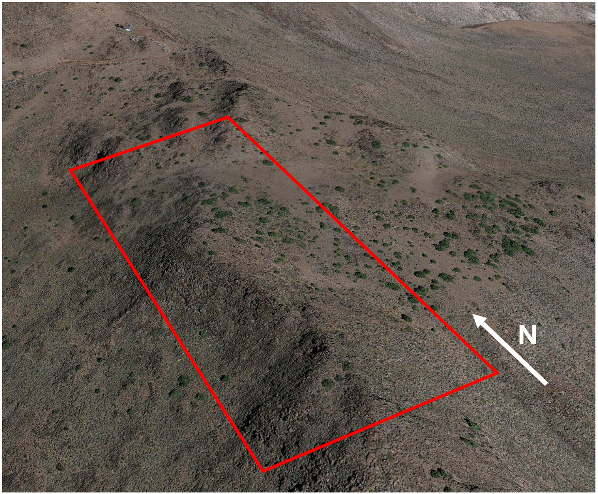
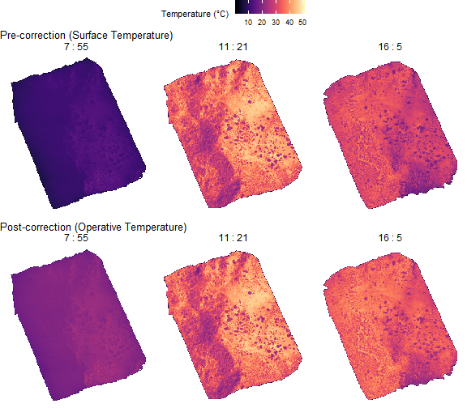
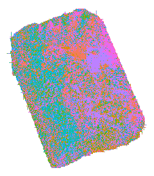
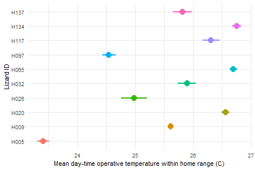

<style>
p.caption {
  font-size: 0.9em;
}
</style>


# Overview

In this vignette we illustrate a case study to serve as a worked out example on how to implement the `throne` method. In this example, we will be looking at the thermal environment experienced by a population of western fence lizards (*Sceloporus occidentalis*) living at approximately 2400 m of elevation in the Great Basin of Northern Nevada and undergoing mark-recapture. Following the `throne` method, we will first describe our field methodology (i.e., flights conducted, operative temperature model deployment etc.), then describe the analysis ran in `R` using the `throne` package and finally offer some insights on how the `throne` method could be used in ecological studies.

# Study area and organism

The population of western fence lizards discussed in this example inhabits a high elevation outcrop in the Great Basin of Northern Nevada. The site is characterized by a mosaic of sagebrush and pinyon-juniper woodlands interrupted by rocky outcrops of varying sizes. The area of interest also has a remarked degree of topographic heterogeneity with a ridge along the north-south axis dividing into two slopes: 

<div class="figure" style="text-align: center">

<p class="caption">Study area within the Great Basin of Northern Nevada, the red rectangle indicates the specific area of interest we will be focusing on.</p>
</div>

<div class="figure" style="text-align: center">

<p class="caption">Topography of the area of study. A ridge divides the area between an eastern-facing side a relatively gentle slope and a western-facing side with a steep slope even becoming a precipice in some spots</p>
</div>

The study organism for this example is the western fence lizard (*Sceloporus occidentalis*), a species native the western US that is locally abundant in the study area. This lizard is predominately spotted in the rocky outcrops that interrupt the landscape which it uses to bask during day-time hours. This example focuses on 10 adult lizards that underwent mark-recapture during the month August of 2022.

<div class="figure" style="text-align: center">

<p class="caption">A western fence lizard basking on a rock in the study area. Note that this individual is marked through a color combination painted on its side (Blue - Silver - Pink) used to identify it in the field.</p>
</div>

# Field workflow

## Collect and process thermal images.

We flew 3 flights over an ~ 95000 $m^2$ area overlapping with the areas that we surveyed as part of the lizard mark-recapture. Two flights were conducted on the same day (`08/04/2022`) at `07:55` and `11:21` and a third flight was conducted 2 days later at `16:05`. Here's the metadata file for flights conducted. Below is the metadata for all flights


``` r
# specify folder where the package data is stored
folder <- "C:/Users/ggarc/OneDrive/research/throne/" # modify this to local path

# load the metadata file for all flights
load(paste(folder, "case_study_data/c_flights_metadata.RData", sep = ""))

# show metadata
c_flights_metadata
```

```
##    flight_id     date time_start time_end
## 1 c_flight_1 8/6/2022      16:05    16:28
## 2 c_flight_2 8/4/2022      11:21    11:45
## 3 c_flight_3 8/4/2022       7:55     8:19
```

All flights were processed using the software `Pix4D` following the steps we present in the [Collecting and process thermal images vignette](https://ggcostoya.github.io/throne/articles/collect_n_process_thermal_images.html) included as part of the `throne` documentation to obtain 3 thermal orthomosaics (i.e., `.tif` files).

## Collect and process operative temperature data

We 3D printed 150 operative temperature models using ABS plastic of the same shape, size and painted them to match the reflective properties of the western fence lizard. Inside of each model, we placed a Thermocron iButton logger set to record temperature every 60 minutes. We deployed these OTMs randomly throughout the site as, at the time, we did not have the expertise necessary for a more informed deployment. Fortunately, the sheer number of OTMs enabled us to capture a wide enough range of micro habitats.

<div class="figure" style="text-align: center">

<p class="caption">An operative temperature model of the type used for this study.</p>
</div>

The OTM metadata file we assembled looked like:


``` r
# load metadata file 
load(paste(folder, "case_study_data/c_otms_metadata.RData", sep = ""))

# show metadata 
c_otms_metadata
```

```
## # A tibble: 150 × 3
##    otm_id latitude longitude
##    <chr>     <dbl>     <dbl>
##  1 H1         39.7     -119.
##  2 H2         39.7     -119.
##  3 H3         39.7     -119.
##  4 H4         39.7     -119.
##  5 H5         39.7     -119.
##  6 H6         39.7     -119.
##  7 H7         39.7     -119.
##  8 H8         39.7     -119.
##  9 H9         39.7     -119.
## 10 H10        39.7     -119.
## # ℹ 140 more rows
```

# R workflow

## Reading and processing flights data

Following the `R` workflow specified in the `throne` package, the first step is to read and process the flights data. An important part of this step is to specify the `resolution` argument which will set the spatial resolution of each of the tiles in the final thermal landscape prediction. For this example, we choose to set `resolution = 1.5`, which is representative of a micro habitat a lizard might be experiencing. We read and process the flights data using the `rnp_flights_data` function as follows:


``` r
## The code below is an example of how to read and process the flights data, DO NOT RUN ##

# set files path
flight_files_path <- "x" # This would be a folder within the user's computer, not specified here

# read and process flights data (assuming that the metadata file is the one that was prevously loaded)
c_flights_data <- rnp_flights_data(path = flight_files_path,
                                   metadata = c_flights_metadata,
                                   resolution = 1.5)
```

The outcome will be a flights data `tibble` storing all of surface temperature (`surf_temp`) measurements collected across all flights:


``` r
head(c_flights_data)
```

```
##            x       y surf_temp year doy mod_start mod_end
## 163 289237.2 4402770  7.102429 2022 218       965     988
## 164 289238.4 4402770 20.579145 2022 218       965     988
## 165 289239.6 4402770 20.628806 2022 218       965     988
## 166 289240.8 4402770 19.866348 2022 218       965     988
## 167 289242.0 4402770 20.161145 2022 218       965     988
## 168 289243.2 4402770 20.978074 2022 218       965     988
```

We can plot this data using `ggplot2` tools to already get a sense of the thermal characteristics of the study area:


``` r
c_flights_data |>
  mutate(hour = paste(floor(mod_start/60),":", mod_start - floor(mod_start/60) * 60)) |>
  mutate(hour = fct_reorder(hour, mod_start)) |>
  ggplot(aes(x = x, y = y, fill = surf_temp)) +
  geom_raster() +
  scale_fill_viridis(option = "magma") +
  facet_grid(cols = vars(hour)) +
  theme_void() +
  theme(strip.text = element_text(size = 12),
        legend.position = "top") +
  guides(fill = guide_colorbar(title = "Surface temperature (°C)"))
```

<div class="figure" style="text-align: center">

</div>

## Reading and processing OTMs data

The next step would be to read and process the data collected via the OTMs. We can do this through the `rnp_otms_data` function from the `throne` package. Before we do that, we should check the structure of our raw OTM `.csv` files. In this example they look like this:


```
##     raw_date_time temp otm
## 1 6/13/2022 14:18 27.0 H22
## 2 6/13/2022 15:18 18.0 H22
## 3 6/13/2022 16:18 21.5 H22
## 4 6/13/2022 17:18 16.0 H22
## 5 6/13/2022 18:18 10.0 H22
## 6 6/13/2022 19:18  8.0 H22
```

By taking a look at this (and other files) we can tell that there is no need to skip any rows when reading them as `.csv` which means that we can set the `rows_skip` argument of `rnp_otms_data` to `0`, such that it can start reading from the first row. We can also see that the column `raw_data_time` contains information on both the date and the time of each measurement and thus, that we should set the `date_col` argument to `1`. We could also specify `time_col = 1`, but that's not necessary as if no `time_col` is specified, `rnp_flights_data` will assume that `date_col = time_col`. Lastly, we can see from this file that the operative temperature measurements are stored in the second column and that, as a result, we should set the `op_temp_col` argument to `2`. With this in mind, we can read and process the OTM data as follows:


``` r
## The code below is an example of how to read and process the flights data, DO NOT RUN ##

# specify the path to where the OTM .csv files are stored
otm_files_path <- "x" # This would be a folder within the user's computer, not specified here

# read and process OTMs data (using the metadata file that was previously loaded)
c_otms_data <- rnp_otms_data(path = otm_files_path,
                             metadata = c_otms_metadata,
                             rows_skip = 0,
                             date_col = 1, # same as time_col
                             op_temp_col = 2)
```

The outcome will be an OTM data `tibble` containing all the observations made by all OTMs:


``` r
head(c_otms_data)
```

```
##   otm_id year doy  mod op_temp latitude longitude        x       y
## 1     H1 2022 164  850    17.0 39.74506 -119.4597 289251.9 4402355
## 2     H1 2022 164  910    15.0 39.74506 -119.4597 289251.9 4402355
## 3     H1 2022 164  970    17.0 39.74506 -119.4597 289251.9 4402355
## 4     H1 2022 164 1030    16.0 39.74506 -119.4597 289251.9 4402355
## 5     H1 2022 164 1090    15.5 39.74506 -119.4597 289251.9 4402355
## 6     H1 2022 164 1150    13.0 39.74506 -119.4597 289251.9 4402355
```

## Generate OTM spline models

Having read the OTMs data, the next step is to define **cubic splines models** to describe the thermal dynamics of each OTM on each `doy` during its deployment. To do this, we can use the `gen_otm_splines` function of the `throne` package. For this step, a crucial user input is the `knot_p` parameter which will determine the "wiggliness" of the spline model. [Choosing th appropriate `knot_p` value](https://ggcostoya.github.io/throne/articles/rnp_otms_data_gen_otm_splines.html#choosing-the-appropriate-knot_p-value) is dependent on the recording frequency at which we set our OTMs and the thermal properties of the organism of interest itself. Based on the thermal properties of our organism of interest (*Sceloporus occidentalis*), we would ideally a spline model with 1 knot for every 15 minutes, which is the typical time this lizard takes to acclimate to a new temperature. However, OTMs recorded at a frequency of 1 observation / hour. At this low frequency, we want to preserve as much information on the thermal fluctuations of the OTM as possible which is why setting `knot_p = 1` works fine. To obtain the spline models, we can simply run:


``` r
c_otms_splines <- gen_otm_splines(otm_data = c_otms_data, knot_p = 1)
```

Which returns a nested `tibble` with all `otm_id` & `doy` specific models (in the column `spline`):


``` r
c_otms_splines
```

```
## # A tibble: 11,008 × 8
##    otm_id  year   doy latitude longitude       x        y spline    
##    <chr>  <dbl> <dbl>    <dbl>     <dbl>   <dbl>    <dbl> <list>    
##  1 H1      2022   164     39.7     -119. 289252. 4402355. <smth.spl>
##  2 H1      2022   165     39.7     -119. 289252. 4402355. <smth.spl>
##  3 H1      2022   166     39.7     -119. 289252. 4402355. <smth.spl>
##  4 H1      2022   167     39.7     -119. 289252. 4402355. <smth.spl>
##  5 H1      2022   168     39.7     -119. 289252. 4402355. <smth.spl>
##  6 H1      2022   169     39.7     -119. 289252. 4402355. <smth.spl>
##  7 H1      2022   170     39.7     -119. 289252. 4402355. <smth.spl>
##  8 H1      2022   171     39.7     -119. 289252. 4402355. <smth.spl>
##  9 H1      2022   172     39.7     -119. 289252. 4402355. <smth.spl>
## 10 H1      2022   173     39.7     -119. 289252. 4402355. <smth.spl>
## # ℹ 10,998 more rows
```

## Correcting flight data

The next step in the `throne` package workflow is to correct the data obtained via flights using OTM flights data. To achieve this, we will use the `correct_flighs_data` function. To use the function, we will specify that we want a time correction (`time_correction = TRUE`), that we want the mean to be the metric used for the time correction (`time_correction_metric = "mean"`) but that we do not want a flight-specific correction (`flight_specific_correction = FALSE`, the default parameter): 


``` r
c_flights_data_corr <- correct_flights_data(flights_data = c_flights_data, 
                                            otm_splines = c_otms_splines,
                                            time_correction = TRUE,
                                            time_correction_metric = "mean",
                                            flight_specific_correction = FALSE)
```

We can visualize below the effects of the correction process (`Post-correction`) with respect to the data from the original flights (`Pre-correction`).


``` r
# plot the flights pre-correction
pre_corr <- c_flights_data |>
  mutate(hour = paste(floor(mod_start/60),":", mod_start - floor(mod_start/60) * 60)) |>
  mutate(hour = fct_reorder(hour, mod_start)) |>
  ggplot(aes(x = x, y = y, fill = surf_temp)) +
  geom_raster() +
  scale_fill_viridis(option = "magma") +
  facet_grid(cols = vars(hour)) +
  ggtitle("Pre-correction (Surface Temperature)") +
  theme_void() +
    theme(strip.text = element_text(size = 12)) +
  guides(fill = guide_colorbar(title = "Temperature (°C)"))

# plot the flights post-correction
post_corr <- c_flights_data_corr |>
  mutate(hour = paste(floor(mod_start/60),":", mod_start - floor(mod_start/60) * 60)) |>
  mutate(hour = fct_reorder(hour, mod_start)) |>
  ggplot(aes(x = x, y = y, fill = op_temp)) +
  geom_raster() +
  scale_fill_viridis(option = "magma") +
  facet_grid(cols = vars(hour)) +
  ggtitle("Post-correction (Operative Temperature)") +
  theme_void() +
    theme(strip.text = element_text(size = 12)) +
  guides(fill = guide_colorbar(title = "Temperature (°C)"))

ggarrange(pre_corr, post_corr, nrow = 2, ncol = 1, common.legend = TRUE, legend = "top")
```

<div class="figure" style="text-align: center">

</div>

## Match flight to OTM data

The last step before being able to predict thermal landscapes is to match the thermal dynamics of each of the tiles within our corrected flights data to the dynamics of a given OTM. To achieve this, we can use the `match_data` function from the `throne` package. To use this function, two user-specific inputs are needed: `coverage_per` and `error_max`. The first one determines the degree of coverage across multiple flights that a tile needs to have in order to be considered in the matching process. As seen below, our flights had a particularly good overlap:


``` r
c_flights_data_corr |>
  group_by(y, x) |>
  summarise(coverage_per = 100*(n()/3)) |>
  mutate(coverage_per = ifelse(coverage_per > 100, 100, coverage_per)) |>
  ggplot(aes(x = x, y = y)) +
  geom_raster(aes(fill = coverage_per)) +
  guides(fill = guide_colorbar(title = "Coverage (%)")) +
  theme_void()
```

<div class="figure" style="text-align: center">

</div>

In our case, we can set `coverage_per = 1` to ensure that only areas covered across all flights are considered although, for a greater number of flights we would recommend setting `coverage_per = 0.9`. The second input (`error_max`) determines the maximum average absolute error between a tile and OTM dynamics that should be specified as a threshold for the matching. If the average absolute difference between a tile's thermal dynamics and the OTM that best describes it is > `error_max`, that tile is not matched to any OTM and thus should not be considered. In this case, we will follow our own specifications and set `error_max = 5`. Now, we can run the `match_data` function as follows:


``` r
c_matches <- match_data(flights_data = c_flights_data_corr, otm_splines = c_otms_splines, coverage_per = 1, error_max = 5)
```

The result will be a matches `tibble` with the OTM that best describes the dynamics of each tile in the site. In the figure below, each tile is colored according to the `otm_id` that best represents it's thermal dynamics.


``` r
head(c_matches)
```

```
##            x       y coverage      error otm_id
## 63  289065.6 4402654        1 11.8962132   H129
## 114 289066.8 4402654        1  1.5364074    H39
## 184 289068.0 4402654        1  0.4646073    H89
## 220 289068.0 4402686        1 10.3619358    H93
## 279 289069.2 4402654        1  0.2772866    H49
## 328 289069.2 4402686        1  2.7483973    H32
```

We can visualize the results of the matching step as shown below:

<div class="figure" style="text-align: center">

</div>

In the plot above, each tile is color coded to match the ID of the OTM that best described it (each color is a unique OTM). Without need for user-specified input, the matching process identified the topography of the terrain, assigning different OTMs to the eastern and western facing sides of the ridge that divides the site.

<div class="figure" style="text-align: center">

</div>

The matching bias (`error`) was generally very low (a good thing) and the number of tiles that could not be assigned to any OTM when setting `error_max = 5` was minimal (tiles highlighted in black). 

## Predicting thermal landscapes

Using all the above, we can finally predict the thermal landscapes of the site using the `predict_thermal_landscape` function of the `throne` package. As an example, below we predict the thermal landscape every hour between 6 AM (`mod = 360`) and 9 PM (`mod = 1260`) on August 10th (`doy = 222`). To obtain this prediction we'd simply run:


``` r
example_prediction <- predict_thermal_landscape(
  matches = c_matches, 
  otm_splines = c_otms_splines,
  doy = 222,
  mod = seq(360,1260, by = 60))
```

We can visualize some predictions as follows:


``` r
example_prediction |>
  filter(!is.na(mod)) |>
  filter(mod %in% c(6*60, 9*60, 13*60, 19*60)) |>
  ggplot(aes(x = x, y = y, fill = pred_op_temp)) +
  geom_raster() +
  scale_fill_viridis(option = "magma") +
  facet_wrap(~mod/60) +
  theme_void() +
  theme(legend.position = "top") +
  guides(fill = guide_colorbar(title = "Predicted Operative Temperature (°C)"))
```

<div class="figure" style="text-align: center">

</div>
Each panel above shows the predicted thermal landscape of the entire site at a given hour of the day. Tiles colored in white are tiles for which no OTM could be assigned during the matching process. 

# Ecological application of the method

Once we obtain the prediction of the thermal landscape we can use it to infer characteristics of the thermal environments experienced by the organism of interest. As an example, here we integrate the thermal landscape prediction with the spatial distribution of the home ranges of 10 individual lizards of our population of interest. Below is the mark-recapture example data set we will use:


``` r
lizard_mr
```

```
## # A tibble: 36 × 7
##    id    sex    year   doy   mod        y       x
##    <chr> <chr> <int> <dbl> <dbl>    <dbl>   <dbl>
##  1 H005  M      2022   175   720 4402397. 289268.
##  2 H005  M      2022   200   767 4402413. 289264.
##  3 H005  M      2022   173   678 4402417. 289269.
##  4 H005  M      2022   180   720 4402415. 289295.
##  5 H009  M      2022   193   704 4402510. 289395.
##  6 H009  M      2022   216   630 4402492. 289327.
##  7 H009  M      2022   173   753 4402553. 289316.
##  8 H009  M      2022   214   784 4402560. 289324.
##  9 H020  M      2023   166   765 4402683. 289237.
## 10 H020  M      2022   195   774 4402683. 289234.
## # ℹ 26 more rows
```

Our spatially explicit mark-recapture data set allows us to estimate each individual's territory as an individual-specific minimum convex polygon. We can plot each individual's home range on top of the predicted thermal landscape at 10 AM as an example:


``` r
# load necessary package to add a second fill scale
library(ggnewscale)

# plotting
ggplot() +
  geom_raster(data = example_prediction |>filter(mod == 10*60),
              aes(x = x, y = y, fill = pred_op_temp)) +
  scale_fill_viridis(option = "magma") +
  new_scale_fill() +
  geom_polygon(data = lizard_mr,
               aes(x = x, y = y, fill = id),
               alpha = 0.75, col = "black", linewidth = 0.5) +
  theme_minimal()
```

<div class="figure" style="text-align: center">

</div>

We can hen calculate the average predicted operative temperature experience by each individual within their home range as:


``` r
# holder object
example_pred_lizards <- tibble(id = c(), y = c(), x = c(), mod = c(), pred_op_temp = c())

# get unique lizard id list
lizard_list <- unique(lizard_mr$id)

# loop to filter the prediction for each unique lizard's home range
for(i in 1:length(lizard_list)){

  # select polygon for the lizard
  lizard_polygon <- lizard_mr |>filter(id == lizard_list[i])

  # filter thermal landscape for rough home-range for each lizard
  rough_home_range <- example_prediction |>
    filter(x >= min(lizard_polygon$x) & x <= max(lizard_polygon$x) &
             y >= min(lizard_polygon$y) & y <= max(lizard_polygon$y)) |>
    mutate(id = lizard_list[i]) |>
    select(id, y, x, mod, pred_op_temp)

  # bind to holder object
  example_pred_lizards <- rbind(example_pred_lizards, rough_home_range)

}
```

>**NOTE**: The above is an approximation, for more detailed (and accurate) method to estimate individual home ranges please consider checking ["Using spatial data with R"](https://cengel.github.io/R-spatial/)

We can visualize the average predicted operative temperature experienced by each individual within their home range as follows:


``` r
example_pred_lizards |>
  ggplot(aes(x = pred_op_temp, y = id)) +
  stat_summary(aes(col = id), linewidth = 1, size = 1) +
  ylab("Lizard ID") + xlab("Mean day-time operative temperature within home range (C)") +
  theme_minimal() +
  theme(legend.position = "none")
```

```
## No summary function supplied, defaulting to `mean_se()`
```

<div class="figure" style="text-align: center">

</div>

As seen above, individuals experience substantially different thermal environments on average, but how does this translate by hour of the day?:


``` r
example_pred_lizards |>
  ggplot(aes(x = mod/60, y = pred_op_temp)) +
  stat_summary(aes(col = id), geom = "line", linewidth = 2, alpha = 0.5) +
  stat_summary(geom = "line", linewidth = 2) +
  ylab("Mean day-time operative temperature within home range (C)") +
  xlab("Hour of the day") +
  theme_minimal()
```

<div class="figure" style="text-align: center">

</div>

Lastly, we can consider what is the ecological relevance of the different conditions experienced by each individual by examining the percentage of their home range that falls within their **preferred temperature** ($T_{pref}$), which for this species falls between 30 and 35 C. We can visualize this percentage by hour of the day as follows:


``` r
example_pred_lizards |>
  mutate(at_tpref = ifelse(pred_op_temp >= 30 & pred_op_temp <= 35, 1, 0)) |>
  group_by(mod, id) |>summarise(at_tpref = mean(at_tpref)) |>
  ggplot(aes(x = mod / 60, y = at_tpref * 100)) +
  geom_line(aes(col = id), linewidth = 2, alpha = 0.5) +
  stat_summary(geom = "line", col = "black", linewidth = 2) +
  ylab("% of home range within 30 - 35 C") +
  xlab("Hour of the day") +
  theme_minimal()
```

<div class="figure" style="text-align: center">

</div>
Individuals differ substantially on the percentage of their home range that falls within their preferred temperature range. This information can be used to infer the potential impact of the thermal landscape on the fitness of each individual.


