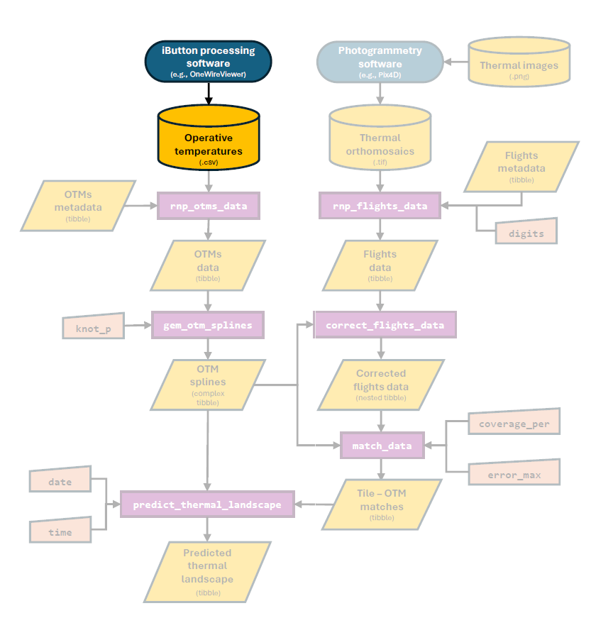
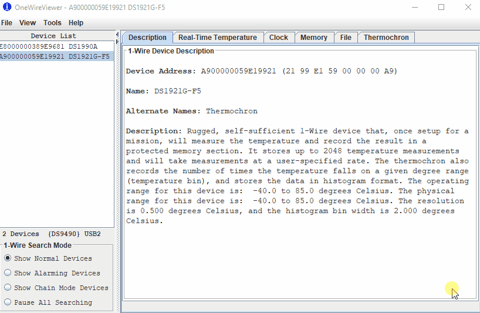
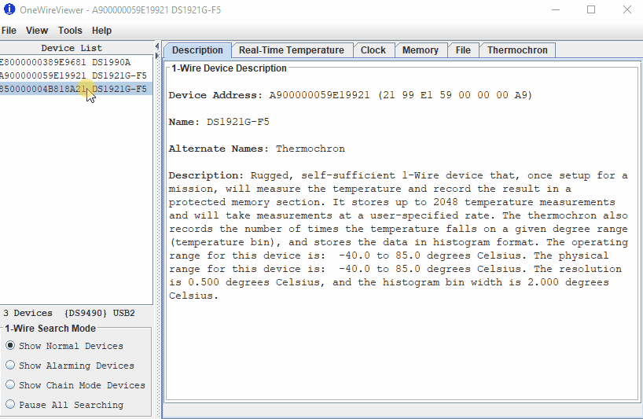

<style>
p.caption {
  font-size: 1em;
}
</style>

```{r setup, include=FALSE}
knitr::opts_chunk$set(echo = TRUE)
devtools::load_all()
```

# Overview

In this vignette our goal is to present the co-first step of the workflow presented in the `throne` package, the collection of **operative temperature model** (**OTM**) data.To collect this data we will need to 1) build, 2) program, 3) deploy and 4) read the measurements collected by the OTM. Here, we will provide some general guidelines on how to perform each of this steps such that they integrate adequately with the software developed for the `throne` package. In the context of the whole package's workflow, we highlight the areas covered in this vignette below:

```{r, echo=FALSE, out.width = '80%', fig.align = 'center', fig.cap = "Figure 1. Part of the workflow covered in this vignette"}

```

# Building OTMs 

Typically, an OTM is the sum of two components; a body and a temperature logger which is contained inside of the body. The physical properties of the body of the OTM will determine its internal temperature which in turn will be captured by the temperature logger. The goal when building an OTM's body is that it matches the biophysical properties of the organism of interest as accurately as possible such that the temperature measured by the logger closely matches that which the organism would experience if it were on the exact spot where that OTM is deployed. This is the concept of **operative temperature**. To that end, it is recommended that the body is of a similar volume, mass and color of the organism of interest to ensure that properties such conduction and convection and radiative heat transfer are comparable. Many techniques have been employed over the years to achieve a body of such characteristics. For instance, in the study of terrestrial ectotherms (where OTMs are more commonly used), copper pipes were historically considered to be an accurate analog to many organisms. However, as part of a separate study, we showed that 3D printing can surpass the performance of copper pipes at a fraction of the cost. We strongly recommend 3D printing to build OTM bodies as we detail in [Alujević et al. 2024](https://www.sciencedirect.com/science/article/pii/S0306456523003030). As an example, below is a picture of the OTM bodies we used for this study: 


The second component of an OTM is the temperature logger. We recommend using iButton temperature loggers. For this study, we used the [thermocron DS1921G-F5#](https://www.embeddeddatasystems.com/Thermochrons-Hygrochron_c_29.html) from Embedded data systems at ~ 50 US Dollars / unit (down to 40 US Dollar / unit if they are ordered in bulk). Other models are available at similar prices so we leave it up to the user to make their own choice. Nonetheless, when choosing an iButton model we recommend considering:

1. That the iButton has a **temperature range** that falls outside of the typical range of temperatures that are expected on the area of interest.
2. That it has as great of a recording accuracy as possible. 
3. That it has a a thermal resolution that is relevant for the study. For example, an iButton that can only record temperature changes at 10 C intervals would not be optimal when studying micro climatic variation in the order of a few C, but an iButton with a resolution of of 0.5 - 1 C might suffice. 
4. That the iButton can store a **number of readings** at a **frequency** that is adequate for the study. Ideally OTMs will be deployed in the field for longer periods of time so the user will need to consider the trade-off between a logging frequency that is relevant to capture the thermal fluctuations of the environment and the number of readings the iButton can store at that logging frequency. 

# Programming iButtons

Before the OTM is deployed in the field, the iButton it contains must be programmed. To program and iButton 3 things are needed, 1) a **reader** to be able to read and transfer data to and from the iButton, 2) an **adapter** that can transmit information from the reader to a computer and 3) a **processing software** from which instructions and data can be inputed and retrieved. For each of these purposes we used the [DS1402D-DR8 + iButton Reader](https://www.ibuttonlink.com/products/ds1402d-dr8) and the [DS9490B# USB 1-Wire Adapter](https://www.ibuttonlink.com/products/ds9490b) by iButtonlink and the software [OneWireViewer](https://www.analog.com/en/resources/evaluation-hardware-and-software/1-wire-sdks/download-1wire-ibutton-drivers.html) by Analog Devices. Other hardware and software could be used if the same outcome is achieved but we strongly recommend using **OneWireViewer** from the software front as it is **completely free**. In that spirit, below we offer a short step by step tutorial on how to programm iButtons using this software which we also present in a `GIF` below: 

1. Download OneWireViewer. An instructional video on how to get started can be found [here](https://www.analog.com/en/resources/media-center/videos/6313216031112.html). Note that the software is a Java-based applet, so [Java](https://www.java.com/en/download/) will need to be installed before proceeding. 
2. Connect the adapter to the reader.
3. Insert the iButton reader into an available USB-port. If the software is launched for the first time, a USB port will need to be selected. Choose a USB-port from the drop-down list if prompted.
4. Insert an iButton into the reader. If the iButton is working it will appear as a device with a serial number in the software's left window panel; if the iButton does not show up then it is likely unusable or malfunctioning.
3. Select the iButton in the list of devices on the left, and go to the "Thermochron" tab.
4. Click "Start new mission" to start programming the iButton.
5. Check the box that says “Synchronize Real-time Clock”. This will make sure the iButton's internal real-time clock is synchronized with the time on the PC that is being used for programming.
6. Enter the "Sampling Rate", in minutes.
7. Enter "Mission Start Delay", which will be the time before the first data sample will be collected. Note that this is in *minutes*; for example, for a 24h delay in recording the delay will need to be of 1440 minutes. 
8. Do **not** "Enable Rollover" unless you want your data to be overwritten once the memory is full. 
9. Click "OK". The line reading "Is Mission Active?" should change from "False" to "True" within a second or two. It will also display "First sample not yet collected". 
10. Insert the iButton inside the OTM ensuring that an air-tight, water-proof seal is achieved and the OTM is ready to be deployed in the field.

```{r, echo=FALSE, fig.align = 'center', fig.cap = "Figure 2: Step-by-step process on how to program an iButton using the OneWireViewer software"}

```

> **NOTE**: It will be up to the user to figure out the math related to the sampling rate which will be dependent on the iButton's storing capacity (i.e., the number of readings it can hold). Often, the need to record temperatures over a long period of time minimizes the number of observations within a given day. To that end, we recommend that, if multiple OTMs are to be deployed, that their "Mission Start Delay" is modified accordingly such that there is a certain degree of staggering in the measurements they record. Say that we are interested in recording daily thermal fluctuations for a period of multiple months such that the minimum sampling rate we can afford is 2h. In that case we would recommend splitting OTMs into two groups one with a "Mission Start Delay" of 1440 minutes and another with 1500 such that the eventual recordings are staggered by 60 minutes. 

# Deploying OTMs in the field 

Once OTMs are programmed the next step is to deploy them in the field. As a general rule we recommend deploying the maximum number of OTMs possible within budget constraints. A greater number of OTMs will enable the capture of a greater number of thermal microhabitats which will be crucial in subsequent steps of the `throne` package. In addition, we recommend **informed as opposed to random deployment** throughout the area of study to minimize the degree of overlap in the information provided by each logger. To achieve informed deployment, we recommend the following: 

1. Become familiar with your area of study to identify general microhabitats to target as well as daily temperature fluctuations. A key point here is identifying the generalorientation of your study site which will determine the incidence of the sun. 
2. Deploy OTMs evenly across all microhabitats and surfaces with different orientations within your site. 
3. If possible, add replicates for each but if the number of possible replicates is limited, favor microhabitats that are more represented in your area of study. 

As an example, the study area we considered to pilot the methodology of the `throne` package is the slope of a small outcrop in the Great Basin Desert. After examining this environment, we considered that placing OTMs in the faces of outcrops (rocks of > 2m in diameter), boulders (1-2 m), rocks (< 1 m), in the ground and inside of small bushes would be an adequate representation of all available micro habitats. Additionally, this outcrop had relatively rough terrain (see below), which generated slopes facing towards all cardinal directions (N, NE, E, SE, S, SW & W) which is why we intentionally placed OTMs facing perpendicularly towards each of these directions. 

```{r, echo = FALSE, fig.align = 'center', fig.cap = "Figure 3: Elevational profile of our area of study"}
raster <- rasterFromXYZ(elevation)

Latitude <- seq(39.86829, 39.86924, length.out = 126)
Longitude <- seq(-119.6277, -119.6264, length.out = 96)
Elevation <- as.matrix(raster)


plot_ly(x = ~ Longitude, y = ~Latitude, z = ~Elevation) %>% 
  add_surface(contours = list(z = list(show = TRUE, start = min(elevation$elevation), end = max(elevation$elevation), size = 2))) %>% 
  layout(scene = list(aspectratio = list(x = 1, y = 1, z = 0.4)))

```

# Reading iButton data

The last step of the process will be to recover the OTMs from the field and read the data collected by the iButtons. The reading process is very similar to the programming with steps 2-4 above being the same. Below we offer yet another small tutorial on how to fully read and download this data which we also show as a `GIF` (Figure 4):

1. Select the iButton in the software's left window pane.
2. Navigate to the "Thermocron" tab, then "Temperatures".
3. The reader will take a second to display in a graph of the temperatures plotted over time. Once the graph shows up, right-click anywhere within the graph window for a drop-down menu to appear.
4. Select **"Save Data to `.csv` File"** and save the file in a directory within your computer. Keep track of this directory as its direction will be the input of subsequent `R` functions as part of the `throne` `R` workflow. 

> **NOTE**: The data will remain on the iButton until it is programmed anew. Once you start a new mission, the old mission data will be lost, so we **strongly(( recommend to make sure all data has been correctly downloaded before re-deployment. 

```{r, echo=FALSE, out.width = '80%', fig.align = 'center', fig.cap = "Figure 4 Step-by-step process on how to read data logged by an iButton using the OneWireViewer software"}

```
