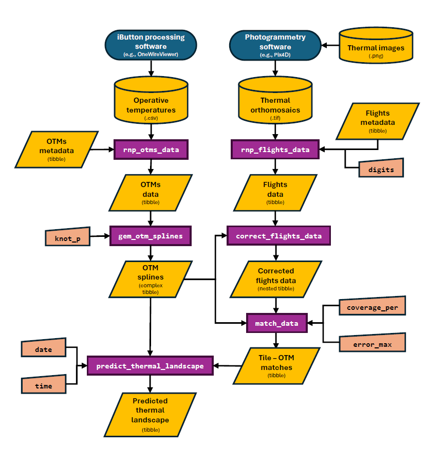

```{r setup, include=FALSE}
knitr::opts_chunk$set(echo = TRUE)
devtools::load_all()
```

Welcome to `throne`! In this vignette, we will provide a general overview of the aims and functionality of this package as well as links to subsequent vignettes including details on each of the steps of the process. 

# The aim of `throne`. 

The overall aim when using the `throne` package is to obtain a **spatio-temporally complete prediction of the thermal landscape of an area of interest**. By thermal landscape, we refer to a data set that includes temperature measurements in a specified area (i.e., a set of "tiles" described by a unique latitude and longitude) across multiple moments in time (i.e., years, days all the way down to minutes). To generate these predictions, the `throne` package integrates spatially complete but temporally discrete thermal data collected via aerial photogrammetry using **th**ermal imaging dr**one**s (hence `throne`), with spatially discrete but temporally complete operative temperature data collected via **operative temperature models** (OTMs). Generating spatio-temporally complete thermal landscapes allows users to obtain a characterization of the thermal properties of an area of study at an unprecedented level of detail. Below is an example of the final output of the `throne` package, a predicted thermal landscape over an area of study across all times for an entire day: 

```{r, echo=FALSE, out.width = '60%', fig.align = 'center'}
knitr::include_graphics("images/case_dynamic_thermal_landscape.gif")
```

# The `throne` workflow

Below is a diagram of the entire workflow of the `throne` package. In essence, the entire process is divided into `8` steps that are performed in processing software and in `R`: 

```{r, echo=FALSE, out.width = '80%', fig.align = 'center'}

```

The steps of the workflow are discussed in the following sections and we also provide a [case study](https://ggcostoya.github.io/throne/articles/case_study.html) as an example on how to implement this workflow on data from our own study system.

### **1. Collect & process thermal images**

The first step is to collect thermal images using a thermal imaging drone. To achieve this, the users will need to:

1. Acquire a thermal imaging drone. 
2. Plan and conduct flights with the thermal imaging drone multiple times over an area of interest. 
3. Process the thermal imagery using a photogrammetry software to obtain a thermal orthomosaic (i.e., a `.TIF` file) for each flight. 

To achieve this, we have included a [step-by-step guide](https://ggcostoya.github.io/throne/articles/collect_n_process_thermal_images.html) on how to perform each of these steps that also includes recommendations on the kind of drone and photogrammetry software to use. 

### **2. Collect OTM data**

The second step is to collect operative temperature model (OTM) data. We elaborate on the concept [here](https://ggcostoya.github.io/throne/articles/collect_otm_data.html#building-otms) but in short, an operative temperature is a measurement of temperature performed inside of an object (i.e., a model) with zero heat capacity, the same size, shape and radiation properties as an organism of interest. Measuring operative temperatures (as opposed to air or surface temperatures) is critical in order to be able to accurately characterize the thermal environment that an organism of interest is actually experiencing. To collect operative temperature model data we also provide a [step-by-step guide](https://ggcostoya.github.io/throne/articles/collect_otm_data.html) that goes through the following steps: 

1. Build OTMs
2. Program temperature loggers (i.e., iButtons) that will be contained inside of the OTM.
3. Plan and conduct the deployment of OTMs in the field. 
4. Recover the OTMs and download the stored data into `.csv` files. 

### **3. Read & process flight data**

The third step is the reading and processing of thermal orthomosaics (`.TIF` files that we call "flight data" for simplicity) into a data structure that can be worked with in the `R` environment. This process is achieved through the [`rnp_flights_data`](https://ggcostoya.github.io/throne/reference/rnp_flights_data.html) function of the `throne` package. In [this vignette](https://ggcostoya.github.io/throne/articles/rnp_flights_data.html) we discuss in detail how this function works and we provide some insights into how to determine the spatial resolution of flights data via the [`digits`](https://ggcostoya.github.io/throne/articles/rnp_flights_data.html#digits) argument. 

### **4. Read & process OTM data**

The fourth step is the reading and processing of the data (in `.csv` format) collected by OTMs deployed in the field. To achieve this, the `throne` package includes the [`rnp_otms_data`](https://ggcostoya.github.io/throne/reference/rnp_otms_data.html) function which is capable of reading OTM data files regardless of the formatting. More details on how this function works can be found [here](https://ggcostoya.github.io/throne/articles/rnp_otms_data_gen_otm_splines.html#how-the-rnp_otms_data-function-works).

### **5. Generate OTM spline models**

The fifth step is the generation of cubic spline models from OTM data which, in the context of the `throne` package, is performed by the [`gen_otm_splines`](https://ggcostoya.github.io/throne/reference/gen_otm_splines.html) function. In short, this function will fit a unique cubic spline model to each OTM for each day it was deployed in the field as a way to obtain a continuous characterization of its temperature fluctuation. In [this vignette](https://ggcostoya.github.io/throne/articles/rnp_otms_data_gen_otm_splines.html#how-the-rnp_otms_data-function-works) we detail how this function works and we provide some guidelines on how to choose the appropriate "wiggliness" of the resulting model through the [`knot_p` argument](https://ggcostoya.github.io/throne/articles/rnp_otms_data_gen_otm_splines.html#choosing-the-appropriate-knot_p-value-)

### **6. Correct flight data**

The sixth step will be the correction of flights data using the newly created spline models using the [`correct_flights_data`](https://ggcostoya.github.io/throne/reference/correct_flights_data.html) function. The need for this correction stems from the fundamental difference in the physical properties of the temperature measurements collected using an IR thermal imaging camera mounted on a drone and those collected using OTMs. The goal of this correction step is to transform thermal maps obtained from the flights into operative temperature maps. The logic of this process and details on how the `correct_flights_data` function works are described extensively in [this vignette](https://ggcostoya.github.io/throne/articles/correct_flights_data.html#overview)

### **7. Match flight and OTM data**

The seventh step of the `throne` workflow is the matching of flights and OTM data. The goal of this step, which can be performed using the [`match_data`](https://ggcostoya.github.io/throne/reference/match_data.html) function is to link the thermal dynamics of each of the tiles (i.e., unique combination of latitude and longitude values) of the study area to the thermal dynamics of an OTM. More details on how the matching process is performed can be found [here](https://ggcostoya.github.io/throne/articles/predict_thermal_landscapes.html#the-match_data-function). 

### **8. Predict thermal landscapes**

The last step is the prediction of thermal landscapes which can be done using the [`predict_thermal_landscape`](https://ggcostoya.github.io/throne/reference/predict_thermal_landscapes.html) function. Combining the OTM spline models with the "matches" data sets, the `predict_thermal_landscape` function is able to produce a thermal landscape of the area of interest for any date and time of day for as long as the OTMs were deployed and recording in the field. We discuss the exact process to predict thermal landscapes [here](https://ggcostoya.github.io/throne/articles/predicting_thermal_landscapes.html#predicting-thermal-landscapes) together with some insight on the high predictive accuracy of this method which we also discuss in the accompanying manuscript. 


