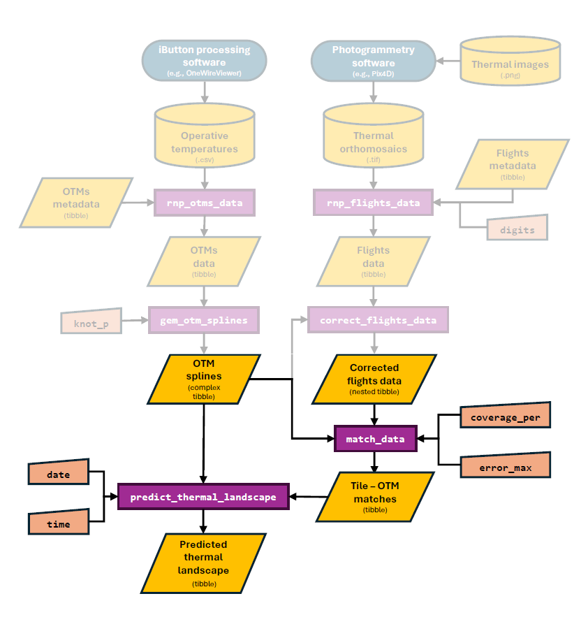

```{r setup, include=FALSE}
knitr::opts_chunk$set(echo = TRUE)
devtools::load_all()
```

```{r echo = FALSE, message = FALSE}
library(dplyr)
library(ggplot2)
library(gridExtra)
library(viridis)
library(metR)
library(plotly)
```

# Overview

In this vignette, our goal is to illustrate the process behind the final step in the workflow of the `throne` package, the prediction of spatio-temporally complete thermal landscapes. To achieve this, `throne` uses two functions: `match_data` and `predict_thermal_landscpe`. The first allows the user to match the thermal dynamics of a given tile within their site (i.e., a unique `latitude` and `longitude`) as measured across multiple flights with those of an **operative temperature model** (**OTM**). The second, uses this matches data set and combines it with information from date & OTM specific cubic spline models (obtained using the `gen_otm_splines` function) to predict the temperature of each tile in the area of interest at any moment in time while the OTMs were deployed in the field. In the context of the overall workflow of the package, this is the section that is covered in this vignette:

```{r, echo=FALSE, out.width = '80%', fig.align = 'center'}

```

# The `match_data` function

The `match_data` function matches the thermal dynamics of specific tiles (i.e., unique `latitude` and `longitude` combinations) collected across multiple flights to the thermal dynamics of an **operative temperature model** (**OTM**). To do so, the function takes in the following inputs inherited from previous functions :

1.  A `flights_data` `tibble` obtained using the `rnp_flights_data`. We **strongly** recommend that this `tibble` undergoes correction using the `correct_flights_data` function in order to ensure that both the `flights_data` `tibble` and the OTMs are on an operative temperature scale. However, the function will allow the user to use an uncorrected `flights_data` `tibble` if they so choose.

2.  An `otm_splines` nested `tibble` obtained using the `gen_otm_splines` function.

Additionally, the `match_data` also requires `2` user specified inputs:

1.  `coverage_per`, a numeric value between 0 - 1 indicating the minimum coverage that a tile should have across all flights provided in order to be included in the matching process. The need for this input can be easily visualized by overlapping the area covered by multiple flights in the provided example `flights_data` (see image below). Due to the unique conditions during each of the `34` flights we conducted to perform this study (e.g., wind etc.), the area covered by each flight was variable, specially when focusing around the edges of our study area. Nonetheless, we foresaw this effect which is why **we ensured that the area covered by each flight would be much larger than the area of interest for our study**, a precaution we recommend all users of this package to follow. Our goal was that the area where we had OTMs would be covered by flights and, as seen above, all OTMs deployed on the ground (black dots) fell on areas that were covered by the vast majority of our flights. **As a general guideline, we recommend setting `coverage_per >= 0.9`**

```{r, fig.width = 6, fig.height = 4, fig.align='center', echo = FALSE, message = FALSE}
# plot
flights_data %>% 
  group_by(longitude, latitude) %>% 
  summarise(times_covered = n()) %>% 
  ggplot(aes(x = longitude, y = latitude)) +
  geom_raster(aes(fill = 100 * times_covered/34)) +
  geom_point(data = otms_splines, col = "black", size = 2) +
  theme_minimal() +
  theme(axis.title = element_blank(),
        axis.text = element_blank()) +
  guides(fill = guide_colorbar(title = "% of times covered"))
  
```

2.  `error_max`, the maximum error between temperature measurements of a tile and the OTM that best represents it, which we elaborate on below.

To match tiles with OTMs that best describe their thermal dynamics, the `match_data` function goes through the following general steps:

1.  It calculates the coverage across all flights for every single tile covered and selects only those tiles that have bee covered as much or more as the `coverage_per` argument specifies.

2.  For each tile, calculate the average absolute error between the temperature measurements of that tile during each flight and the temperature measurements made by every OTM at the exact same time each flight took place.

3.  Select the OTM that minimizes the error between the tile's and the OTMs measurements. In the figure below we illustrate the logic of this approach. The black dots indicate the temperature measurements associated with a given tile (note that these measurements are corrected using the `correct_flights_data` function) across all flights conducted in the days of the year (`doy`) 236, 237 and 238. The red and blue lines indicate the temperatures predicted by the spline model of 2 OTMs for those same `doy`. In this case, the `match_data` function would choose `OTM25` to better represent the dynamics of that tile as the average difference between each of the tile's temperature measurements and those estimated by the cubic spline model for `OTM25` is much smaller than for `OTM05`.

```{r, echo = FALSE, fig.align = 'center', fig.height = 3, fig.width = 8}
# filter 2 OTMs of interest
fig_splines <- otms_splines %>% 
  filter(otm_id %in% c("OTM05", "OTM25")) %>% 
  filter(doy %in% c(236:238))
# predict temperatures with OTMs
otm_preds <- tibble(otm_id = c(), doy = c(), mod = c(), op_temp = c())
for(i in 1:nrow(fig_splines)){
  
  if(fig_splines$doy[i] < 237){mods = c(400:1440)}else{mods = c(0:1440)}
  op_temp_i <- predict(fig_splines$spline[[i]],mods)$y
  otm_pred_i <- tibble(otm_id = fig_splines$otm_id[i],
                       doy = fig_splines$doy[i],
                       mod = mods, 
                       op_temp = op_temp_i)
  otm_preds <- rbind(otm_preds, otm_pred_i)

}

# correct the flights data using correct_flights_data function
flights_data_corrected <- correct_flights_data(flights_data = flights_data, otm_splines = otms_splines)

#plot
flights_data_corrected %>% 
  filter(longitude == -119.62715) %>% filter(latitude == 39.86875) %>% 
  ggplot() +
  geom_point(aes(x = mod_start/60, op_temp), size = 2) +
  geom_line(data = otm_preds, aes(x = mod/60, y = op_temp, col = otm_id), alpha = 0.75, linewidth = 1.25) +
  facet_wrap(~doy) +
  scale_x_continuous(expand = c(0,0), breaks = seq(6,24, by = 6)) +
  xlab("Hour of the day") +
  ylab("Operative Temperature (C)") +
  theme_minimal() +
  theme(axis.line = element_line(),
        panel.spacing.x = unit(0,"lines"),
        strip.text = element_text(size = 12)) 

```

> **NOTE**: The distance between the tile and the OTM is **NOT** weighted for during this step. This is because an OTM that is not necessarily the closest to that tile might actually be able to represent its thermal dynamics much better than one that is closer. For example, a tile that contains a tree might be better represented by an OTM that is deployed inside of a tree at 100 m than one that is on a different facing slope only 2 m away. This approach extends even to a the same tile where an OTM is deployed. Imagine a tile that is mostly facing south but that has a small bush on it. If an OTM is placed precisely inside that bush, its thermal dynamics might not be representative of the average dynamics of that tile and an OTM placed elsewhere might actually represent that tile better. In the figure below we show the results of matching our example data set, where only in 5 cases the same OTM that was on a tile best described its thermal dynamics.

```{r, echo = FALSE, fig.height = 5, fig.width = 6, fig.align = 'center'}
otms_splines_sub <- otms_splines %>% 
  dplyr::select(otm_id, latitude, longitude) %>% unique()
otms_splines_sub$longitude <- as.numeric(format(otms_splines_sub$longitude, nsmall = 5))
otms_splines_sub$latitude <- as.numeric(format(otms_splines_sub$latitude, nsmall = 5))

merge(otms_splines_sub, matches_5, by = c("latitude", "longitude")) %>% 
  rename(actual_otm_id = otm_id.x, matched_otm_id = otm_id.y) %>% 
  mutate(same = ifelse(actual_otm_id == matched_otm_id, "Yes", "No")) %>% 
  ggplot(aes(x = matched_otm_id, y = actual_otm_id, fill = as.factor(same))) +
  geom_tile() +
  xlab("OTM ID matched to that tile") + ylab("OTM ID actually on that tile") +
  theme_minimal() +
  theme(axis.text.x = element_text(angle = 90)) +
  guides(fill = guide_legend("Is it the same?"))

```

4.  If the minimum error is above a certain threshold indicated by he `error_max` parameter do not assign any OTM to a tile. In the figure below we show the results of implementing this step with the areas marked in dark blue indicating tiles for which no OTM could describe it without exceeding the threshold imposed by `error_max`. It is also important to note that these "problematic" tiles are far from the area of interest for this study (where the OTMs, indicated by black dots, where deployed) and that in this area the error is minimized.

```{r, fig.width = 6, fig.height = 4, fig.align = 'center', echo = FALSE}
matches_5 %>%
  mutate(isna = ifelse(is.na(error), 1, 0)) %>%
  ggplot(aes(x = longitude, y = latitude)) +
  geom_tile(data = flights_data, fill = "lightgray") +
  geom_tile(aes(fill = error)) +
  scale_fill_gradient(low = "palegreen", high = "darkorange") +
  geom_tile(aes(alpha = as.factor(isna)), fill = "darkblue", show.legend = FALSE) +
  scale_alpha_manual(values = c(0,1)) +
  geom_point(data = otms_splines, size = 2) +
  theme_minimal() +
  theme(axis.title = element_blank(),
        axis.text = element_blank()) +
  guides(fill = guide_colorbar(title = "Error (C)"))
```

> **NOTE**: The figure above shows all tiles that were covered by at least 1 flights but that were not covered in at least 90% of flights shaded in light gray. As seen above, the high-coverage area is much smaller than the total area covered in flights.

The resulting `matches` `tibble` has the `otm_id` column indicating the OTM that best describes a given tile (i.e., a combination o `latitude` and `longitude`) as well as a column for the matching `error` for the user to inspect if desired. In rows where `error > error_max` the `otm_id` will be specified as `NA`.

```{r}
matches_5
```

> **NOTE**: The `tibble` presented above was generated considering an `error_max = 5`. The `throne` package also includes another matches data set generated with `error_max = 20` that can be accessed by calling `matches_20`.

From this `matches` data we gather some interesting findings. Including that:

1.  Very few OTMs are needed to explain the majority of the sites thermal dynamics. In the example data set, only `5` out of the `33` deployed OTMs deployed were needed to explain more than over 50% of the thermal variability of the site.

```{r, echo = FALSE, message = FALSE, fig.height = 4, fig.width = 6, fig.align='center'}
matches_5 %>% 
  filter(!is.na(otm_id)) %>%
  group_by(otm_id) %>% 
  summarise(tiles_covered = (n()/5606)*100) %>% 
  ungroup() %>%
  arrange(desc(tiles_covered)) %>% 
  mutate(cum_tiles_covered = cumsum(tiles_covered)) %>%
  ggplot(aes(x = reorder(otm_id, -tiles_covered))) +
  geom_hline(yintercept = 95, linetype = 2) +
  geom_col(aes(y = tiles_covered)) +
  geom_point(aes(y = cum_tiles_covered)) +
  geom_path(aes(y = cum_tiles_covered, group = 1)) +
  xlab("OTM ID") +
  ylab("Cummulative % of tiles covered") +
  theme_minimal() +
  theme(panel.grid.minor.y = element_blank(),
        panel.grid.major.y = element_line(linetype = 2, color = "black"),
        axis.text.x = element_text(angle = 90))
```

2.  The matching mechanism will automatically match tiles with a given orientation to OTMs deployed in a tile with the same orientation. As seen below and considering that the site is plotted in a N-S orientation, we can, for example, see that OTMs facing `W` best described tiles that were on a western slope and so on.

```{r, echo = FALSE, fig.height = 6, fig.width = 8, fig.align='center'}
otms_splines_orient <- otms_splines %>% 
  dplyr::select(otm_id,orientation) %>% unique()
orientation_colors <- c("N" = "darkblue", "NW" = "#7F468B","W" = "darkorange",
                        "SW" = "#FCCE7B", "S" = "gold", "SE" = "#90B122",
                        "E" = "forestgreen", "NE" = "#11458B", "Flat" = "maroon")

merge(matches_20, otms_splines_orient, by = c("otm_id"))%>% 
  ggplot(aes(x = longitude, y = latitude)) +
  geom_tile(aes(fill = orientation)) +
  geom_contour(data = elevation, aes(z = elevation), bins = 20, col = "white") +
   geom_text_contour(data = elevation, aes(z = round(elevation)),
                    skip = 1, stroke = 0.2, col = "black", size = 3, bins = 10) +
  scale_fill_manual(values = orientation_colors) +
    theme_minimal() +
  theme(axis.title = element_blank(),
        axis.text = element_blank()) 
  
```

> **NOTE**: In the plot above we use the a `matches` tibble with `error_max = 20` for visualization purposes only.

# Predicting thermal landscapes

The final step in the workflow of the `throne` package is to predict thermal landscapes. To do this, the `thonre` package includes the function `predict_thermal_landscape` which takes in the following inherited inputs:

1.  An `otm_splines` nested `tibble` obtained through the `generate_otm_splines`.

2.  A `matches` tibble associating tiles in a study area with OTMs that best describe their thermal dynamics obtained using the `match_data` function discussed above.

In addition, the `predict_thermal_landscape` function will require the following user-specified inputs:

1.  The day of the year or `doy` (single or multiple) for which a prediction should be generated.

2.  The minute of the day or `mod` (single or multiple) in the `doy` specified for which a prediction should be generated.

Once these inputs are specified, the function will go through the following general steps:

1.  Filter the provided `otm_splines` for splines characterizing OTMs that are also present in the `matches` `tibble` and among these select only models describing the dynamics of that OTM on the `doy` (single or multiple) specified as an argument of the function.

2.  Predict the operative temperature at the specified `mod` (single or multiple) and `doy` for all OTMs.

3.  Merge the operative temperature prediction with the `matches` `tibble` to obtain a predicted operative temperature for every single tile considered.

Since all the necessary calculations have been carried out beforehand (i.e., generating the spline models, performing the matching between tiles and OTMs etc.) the `predict_thermal_landscape` function is relatively fast and allows the user to **predict the entire thermal landscape of their site at any moment while their OTMs were deployed**. For example, say that we want to obtain a complete thermal landscape prediction every hour of the day for the `doy = 237` (i.e., August 24th), one would simply run:

```{r}
# obtain prediction
prediction_237 <- predict_thermal_landscape(matches = matches_20, otm_splines = otms_splines, 
                                            doy = 237, mod = seq(0,1440, by = 60))

prediction_237
```

> **NOTE**: The `predict_thermal_landscape` function will not be able to predict thermal landscapes if the specified time falls outside of the range when OTMs were logging temperatures. To that end, the function will also provide a warning indicating what % of predictions were removed due to falling outside of the range when the OTMs were recording.

We can plot this prediction using regular `ggplot` tools as easily as:

```{r, fig.align='center', fig.height=10, fig.width = 8}
prediction_237 %>% 
  filter(mod %in% seq(6*60,21*60,by = 60)) %>%
  filter(!is.na(mod)) %>%
  ggplot(aes(x = longitude, y = latitude, fill = pred_op_temp)) +
  geom_raster() +
  scale_fill_viridis(option = "magma") +
  facet_wrap(~mod/60) +
  theme_minimal() +
  theme(axis.text = element_blank(), axis.title = element_blank(),
        legend.position = "top",strip.text = element_text(size = 12)) +
  guides(fill = guide_colorbar(title = "Predicted Operative Temperature (C)"))
```

The plot above And when combined into a single image using tools from the [`gganimate`](https://gganimate.com/) package:

```{r, echo=FALSE, out.width = '60%', fig.align = 'center'}
knitr::include_graphics("images/dynamic_thermal_landscape.gif")
```

The `predict_thermal_landscape` function has unlimited power to provide complete thermal landscape predictions at an unprecedented level of detail.
