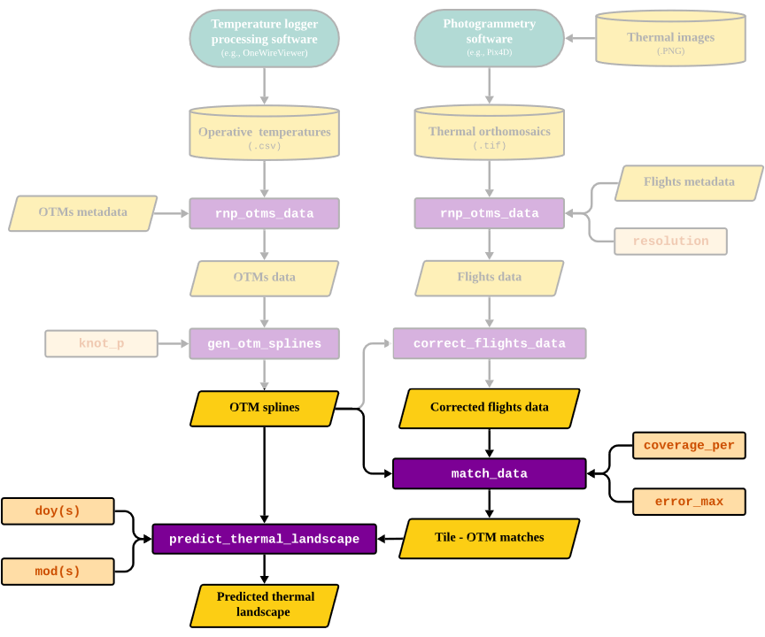

```{r setup, include=FALSE}
knitr::opts_chunk$set(echo = TRUE)
devtools::load_all()
library(dplyr)
library(ggplot2)
library(viridis)
```

# Overview

In this vignette, our goal is to illustrate the process behind the final step of the `throne` workflow; the prediction of spatio-temporally complete thermal landscapes. To achieve this, `throne` uses two functions: `match_data` and `predict_thermal_landscpe`. The first allows the user to match the thermal dynamics of a given tile within their site (i.e., a unique `x` and `y` UTM coordinate combination) as measured across multiple flights with those of an **operative temperature model** (**OTM**). The second, uses this matches data set and combines it with information from date & OTM specific cubic spline models (obtained using the `gen_otm_splines` function) to predict the temperature of each tile in the area of interest at any moment in time while the OTMs were deployed in the field. In the context of the overall workflow of the package, this is the section that is covered in this vignette:

```{r show workflow part, echo=FALSE, out.width = '100%', fig.align = 'center'}

```

# The `match_data` function

The `match_data` function matches the thermal dynamics of specific tiles collected across multiple flights to the thermal dynamics of an **operative temperature model** (**OTM**). This will typically be **the longest step in the `throne`** pipeline but, if done correctly, the user will only need to run it once. Next, we  discuss the function's inputs, processes and output

## Inputs

Te `match_data` function takes in the following inputs:

1.  A flight data set obtained using the `rnp_flights_data`. We **strongly** recommend that this data undergoes correction using the `correct_flights_data` function in order to ensure that both flights and OTM data are on an operative temperature scale. However, the function will allow the user to use uncorrected data if they so choose.

2. An `otm_splines` nested `tibble` obtained using the `gen_otm_splines` function.

3. `coverage_per`, a numeric value between 0 - 1 indicating the minimum coverage that a tile should have across all flights provided in order to be included in the matching process. The need for this input can be easily visualized by overlapping the area covered by multiple flights in the provided example `flights_data` (see below). Due to the unique conditions during each flight, the area covered is variable, specially when focusing around the edges of the area of interest. To circumvent this, we recommend that **the area covered by each flight should be much larger than the area of interest**. With the example data, our goal was to encompass the area where OTMs were deployed in the ground (black dots), and as seen below, we achieved that. **As a general guideline, we recommend setting `coverage_per >= 0.9`**, the value the function will default to if `coverage_per` is not specified. Nonetheless, the function output will also provide a `coverage` column for each tile to further inform the users. 

```{r plot coverage across flights, fig.width = 6, fig.height = 4, fig.align='center', echo = FALSE, message = FALSE}
# get otm coordinates
otm_coords <- otms_data |> dplyr::select(x, y) |> unique()

# plot
flights_data |> 
  group_by(x, y) |> 
  summarise(times_covered = n()) |>
  mutate(times_covered = ifelse(times_covered > 10, 10, times_covered)) |>
  ungroup() |>
  ggplot(aes(x = x, y = y)) +
  geom_tile(aes(fill = times_covered/max(times_covered))) +
  geom_point(data = otm_coords, col = "black", size = 2) +
  theme_minimal() +
  theme(axis.title = element_blank(),
        axis.text = element_blank()) +
  guides(fill = guide_colorbar(title = "% of times covered"))
  
```

4.  `error_max`, the maximum error between temperature measurements of a tile and the OTM that best represents it, which we elaborate on below.

## Processes

To match tiles with OTMs that best describe their thermal dynamics, the `match_data` function goes through the following general steps:

1.  It calculates the coverage across all flights for every single tile covered and selects only those tiles that have been covered as much or more as the `coverage_per` argument specifies.

2.  For each tile, calculate the average absolute error between the temperature measurements of that tile during each flight and the temperature measurements made by every OTM at the exact same time each flight took place.

3.  Select the OTM that minimizes the error between the tile's and the OTMs measurements. In the figure below we illustrate the logic of this approach. The black dots indicate the temperature measurements associated with a given tile (note that these measurements are corrected using the `correct_flights_data` function) across all flights conducted in the days of the year (`doy`) 236, 237 and 238. The red and blue lines indicate the temperatures predicted by the spline model of 2 OTMs for those same `doy`. Between these two, the `match_data` function would choose `OTM25` to better represent the dynamics of that tile as the average difference between each of the tile's temperature measurements and those estimated by the cubic spline model for `OTM25` is smaller than for `OTM05`.

```{r calculate OTM splines, echo=FALSE, message = FALSE,include = FALSE}
# calculate otm splines
otms_splines <- gen_otm_splines(otm_data = otms_data, knot_p = 0.1)
```

```{r plot match between OTM and flight temperature, echo = FALSE, fig.align = 'center', fig.height = 3, fig.width = 8}
# calculate otm splines
otms_splines <- gen_otm_splines(otm_data = otms_data, knot_p = 0.1)

# filter 2 OTMs and days of interest
fig_splines <- otms_splines |> 
  filter(otm_id %in% c("OTM05", "OTM25")) |>
  filter(doy %in% c(236:238))

# holder data set
otm_preds <- data.frame(otm_id = c(), doy = c(), mod = c(), op_temp = c())

# loop to predict temperatures with OTMs
for(i in 1:nrow(fig_splines)){
  
  # set mods to be calculated
  if(fig_splines$doy[i] < 237){mods = c(400:1440)}else{mods = c(0:1440)}
  
  # predict temperature 
  op_temp_i <- predict(fig_splines$spline[[i]],mods)$y
  
  # oreoare return dataset
  otm_pred_i <- data.frame(otm_id = fig_splines$otm_id[i],
                       doy = fig_splines$doy[i],
                       mod = mods, 
                       op_temp = op_temp_i)
  
  # bind to holder data set
  otm_preds <- rbind(otm_preds, otm_pred_i)
  
}

# correct the flights data using correct_flights_data function
flights_data_corrected <- correct_flights_data(flights_data = flights_data, 
                                               otm_splines = otms_splines,
                                               time_correction = TRUE,
                                               time_correction_metric = "mean",
                                               flight_specific_correction = FALSE)

#plot
flights_data_corrected |>
  filter(x == 275280) |> filter(y == 4416475) |>
  ggplot() +
  geom_point(aes(x = mod_start/60, op_temp), size = 2) +
  geom_line(data = otm_preds, 
            aes(x = mod/60, y = op_temp, col = otm_id), 
            alpha = 0.75, linewidth = 1.25) +
  facet_wrap(~doy) +
  scale_x_continuous(expand = c(0,0), breaks = seq(6,24, by = 6)) +
  xlab("Hour of the day") +
  ylab("Operative Temperature (C)") +
  theme_minimal() +
  theme(axis.line = element_line(),
        panel.spacing.x = unit(0,"lines"),
        strip.text = element_text(size = 12),
        axis.ticks = element_line(),
        panel.grid = element_blank()) 

```

> **NOTE**: The distance between the tile and the OTM is **NOT** weighted for during this step. This is because an OTM that is not necessarily the closest to that tile might actually be able to represent its thermal dynamics much better than one that is closer. For example, a tile that contains a tree might be better represented by an OTM that is deployed inside of a tree at 100 m than one that is on a different facing slope only 2 m away. This approach extends even to a the same tile where an OTM is deployed. Imagine a tile that is mostly facing south but that has a small bush on it. If an OTM is placed precisely inside that bush, its thermal dynamics might not be representative of the average dynamics of that tile and an OTM placed elsewhere might actually represent that tile better. In the figure below we show the results of matching our example data set, where only in 5 cases the same OTM that was on a tile best described its thermal dynamics.

4.  If the minimum error is above a certain threshold indicated by the `error_max` parameter do not assign any OTM to a tile. In the figure below we show the results of implementing this step with the areas marked in dark blue indicating tiles for which no OTM could describe it without exceeding the threshold imposed by `error_max` (`error_max = 5` in this case). It is also important to note that these "problematic" tiles are far from the area of interest for this study (where the OTMs, indicated by black dots, where deployed) and that in this area the error is minimized.

```{r plot matching error, fig.width = 6, fig.height = 4, fig.align = 'center', echo = FALSE}
ggplot(data = throne::matches, aes(x = x, y = y)) +
  geom_tile(data = flights_data, fill = "lightgray") +
  geom_tile(aes(fill = error)) +
  scale_fill_gradient(low = "palegreen", high = "darkorange") +
  geom_point(data = otms_splines, size = 2) +
  theme_void() +
  guides(fill = guide_colorbar(title = "Error (C)"))
```

> **NOTE**: The figure above shows all tiles that were covered by at least 1 flights but that were not covered in at least 90% of flights shaded in light gray. As seen above, the high-coverage area is much smaller than the total area covered in flights.

As seen above, `error` rarely exceeds 10 C. This is a good indication that the OTMs are well suited to describe the thermal dynamics of the area of interest. Below is the distribution of error to further illustrate this point.

```{r plot error distribution, fig.width = 5, fig.height = 3, fig.align = 'center', echo = FALSE}
throne::matches |>
  ggplot(aes(x = error)) +
  geom_density(fill = "lightgray") +
  theme_classic() +
  scale_x_continuous(expand = c(0,0), limits = c(0,15)) +
  scale_y_continuous(expand = c(0,0)) +
  xlab("Absolute matching error (C)") + ylab("Density")
```

The resulting `matches` has the `otm_id` column indicating the OTM that best describes a given tile (i.e., a combination of `x` and `y` coordinates) as well as a columns for the matching `error` and the `coverage` across flights for the user to inspect if desired. In rows where `error > error_max` the `otm_id` will be specified as `NA`. Below we show how the function would be run and its output:

```{r example of how match_data should be ran, eval = FALSE}
# mock code to show how match_data would need to be ran
matches <- match_data(flights_data = flights_data_corrected,
                      otm_splines = otms_splines,
                      error_max = 10, # allowing a maximum error of 10 C as an example
                      coverage_per = 0.9) # setting coverage across flights to 90%
```

```{r show head of the matches object}
head(throne::matches)
```

> **NOTE**: The `matches` data set presented above was generated considering with `error_max = 100` that can be accessed by calling `matches`. Both data sets were generated by setting `coverage_per = 0.9`, the default setting. 

From this `matches` data we gather some interesting findings. Including that:

1.  Very few OTMs are needed to explain the majority of the sites thermal dynamics. In the example data set, only `5` out of the `33` deployed OTMs deployed were needed to explain more than over 50% of the thermal variability of the site.

```{r plot distribution of assignment by OTM, echo = FALSE, message = FALSE, fig.height = 4, fig.width = 6, fig.align='center'}
n_tile <- nrow(throne::matches)
throne::matches |> 
  group_by(otm_id) |> 
  summarise(tiles_covered = (n()/n_tile)*100) |> 
  ungroup() |>
  arrange(desc(tiles_covered)) |> 
  mutate(cum_tiles_covered = cumsum(tiles_covered)) |>
  ggplot(aes(x = reorder(otm_id, -tiles_covered))) +
  geom_hline(yintercept = 95, linetype = 2) +
  geom_col(aes(y = tiles_covered)) +
  geom_point(aes(y = cum_tiles_covered)) +
  geom_path(aes(y = cum_tiles_covered, group = 1)) +
  xlab("OTM ID") +
  ylab("Cummulative % of tiles covered") +
  theme_minimal() +
  theme(panel.grid.minor.y = element_blank(),
        panel.grid.major.y = element_line(linetype = 2, color = "black"),
        axis.text.x = element_text(angle = 90))
```

2.  The matching mechanism will automatically match tiles with a given orientation to OTMs deployed in a tile with the same orientation. As seen below and considering that the site is plotted in a N-S orientation, we can, for example, see that OTMs facing `W` best described tiles that were on a western slope and so on.

```{r plot microclimate spatial distribution, echo = FALSE, fig.height = 4, fig.width = 6, fig.align='center'}

# get OTM id and orientation
otms_splines_orient <- otms_splines |> dplyr::select(otm_id,orientation) |> unique()

# set orientation colors
orientation_colors <- c("N" = "darkblue", "NW" = "#7F468B","W" = "darkorange",
                        "SW" = "#FCCE7B", "S" = "gold", "SE" = "#90B122",
                        "E" = "forestgreen", "NE" = "#11458B", "Flat" = "maroon")

#plot
merge(throne::matches, otms_splines_orient, by = c("otm_id"))|> 
  ggplot(aes(x = x, y = y)) +
  geom_tile(aes(fill = orientation)) +
  scale_fill_manual(values = orientation_colors) +
  theme_void() +
  theme(axis.title = element_blank(),
        axis.text = element_blank()) 
```

# Predicting thermal landscapes

The final step in the workflow of the `throne` package is to predict thermal landscapes. To do this, the package includes the function `predict_thermal_landscape`. Next, we will discuss the function's inputs, processes and outputs. 

## Inputs

1.  An `otm_splines` nested `tibble` obtained through the `generate_otm_splines`.

2.  A `matches` data set associating tiles in a study area with OTMs that best describe their thermal dynamics obtained using the `match_data` function discussed above.

3.  The day of the year or `doy` (single or multiple) for which a prediction should be generated.

4.  The minute of the day or `mod` (single or multiple) in the `doy` specified for which a prediction should be generated.

## Processes

Then, `predict_thermal_landscape` will go through the following general steps:

1.  Filter the `otm_splines` for splines characterizing OTMs that are also present in the `matches` object, and, among these, select only models describing the dynamics of that OTM on the `doy` (single or multiple) specified as an argument of the function.

2.  Predict the operative temperature at the specified `mod` (single or multiple) and `doy` for all OTMs.

3.  Merge the operative temperature prediction with the `matches` to obtain a predicted operative temperature for every tile considered.

## Output

The final output of the function will be a `data.frame` of predicted operative temperature values. Since all the necessary calculations have been carried out beforehand (i.e., generating the spline models, performing the matching between tiles and OTMs etc.) `predict_thermal_landscape` is relatively fast and allows the user to **predict the entire thermal landscape of their site at any moment while OTMs were deployed**. For example, below is how one would obtain a complete thermal landscape prediction every hour of the day for the `doy = 237` (i.e., August 24th): 

```{r example of how predict_thermal_landscape should be ran}
# obtain prediction using system.time to show duration 
system.time(prediction_237 <- predict_thermal_landscape(matches = throne::matches, 
                                                        otm_splines = otms_splines, 
                                                        doy = 237, 
                                                        mod = seq(0,1440, by = 60))) # every hour)

head(prediction_237)
```

> **NOTE**: The `predict_thermal_landscape` function will not be able to predict thermal landscapes if the specified time falls outside of the range when OTMs were logging temperatures. To that end, the function will also provide a warning indicating what % of predictions were removed due to falling outside of the range when the OTMs were recording.

We can plot this prediction using regular `ggplot`:

```{r plot resoluts of predicting thermal landscape, fig.align='center', fig.height=9, fig.width = 8}
prediction_237 |> 
  filter(mod %in% seq(6*60,21*60,by = 60)) |>
  filter(!is.na(mod)) |>
  ggplot(aes(x = x, y = y, fill = pred_op_temp)) +
  geom_raster() +
  scale_fill_viridis(option = "magma") +
  facet_wrap(~mod/60) +
  theme_void() +
  theme(
    legend.position = "top",
    strip.text = element_text(size = 12)
    ) +
  guides(fill = guide_colorbar(title = "Predicted Operative Temperature (C)"))
```

The `predict_thermal_landscape` function has [unlimited power](https://www.youtube.com/watch?v=SWwFogRQVnk) to provide complete thermal landscape predictions at an unprecedented level of detail. To showcase the entire `throne` pipeline in action, next we present a case study exemplifying how to implement the method. 

<nav aria-label="Page navigation">
 <ul class="pagination justify-content-end">
  <li class="page-item"><a class="page-link" href="correct_flights_data.html">Previous: Correct flights data</a></li>
  <li class="page-item"><a class="page-link" href="example.html">Next: A worked out example</a></li>
 </ul>
</nav>
