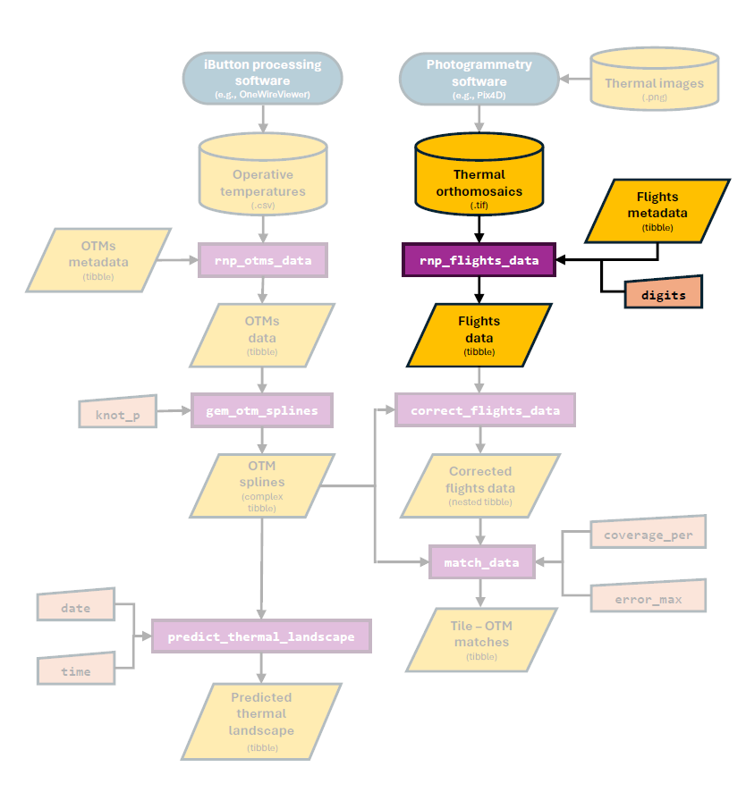

```{r setup, include=FALSE}
knitr::opts_chunk$set(echo = TRUE)
devtools::load_all()
```

# Overview

The goal of this vignette is to illustrate the process behind the `rnp_flights_data` (**r**ead a**n**d **p**rocess flights data) function of the `throne` package. This function enables to processing of raw `.tif` files obtained by combining images gathered during a flight drone flight (see the [Flying drones and obtaining thermal orthomosaics vignette](https://ggcostoya.github.io/throne/articles/drone_setup.html)) into a data frame structure easily manageable in `R`. This data frame will later be related to operative temperature model (**OTM**) data to finally predict thermal landscapes. Below, we highlight the section of the package's workflow that is covered in this vignette:

```{r, echo=FALSE, out.width = '80%', fig.align = 'center'}

```

Next, we present how the `rnp_flights_data` function works, some notes on the choice of the parameter `digits` which will determine the spatial resolution of the final thermal maps.

# Reading and processing flights data

The `rnp_flight_data` function uses the functionality developed by package [`raster`](https://rspatial.org/raster/pkg/index.html) to transform a `.tif` file into a [`tibble`](https://tibble.tidyverse.org/) (similar to a `data.frame` in `R`). Below we detail the functions inputs, processing and output.

The `rnp_flights_data` takes in 3 inputs:

1.  The **`path`** to the directory where all thermal orthomosaics (i.e., `.tif` files) for flights are stored. The function will process all files stored in the folder. If there are many and/or if each file is of considerable size, it will take a substantial amount of time to run. Luckily, it will only need to be ran once. 

2.  A `tibble` or `data.frame` with **`metadata`** for each flight. This metadata file must contain columns for `flight_id`, the `date` when the flight took place (MM/DD/YYYY format), and the time of the day when the flight started and ended (`time_start` & `time_end` columns in HH:MM format). Below is an example metadata `tibble` we include as part of the documentation of the `throne` package:

```{r, echo = FALSE}
as_tibble(flights_metadata)
```

3.  The number of decimal `digits` to which the final output should be summarized to. Specifying this parameter correctly for each user's research purpose is crucial, as it will dictate the spatial resolution of each of the tiles in the eventual thermal landscape. Since we believe this is an absolutely critical issue, we include a section discussing this choice below.

To transform the original `.tif` files, the `rnp_flights_data` function goes through the following general steps:

1.  Read each specified `.tif` file as a as a raster object using the `raster` function from the `raster` package.

2.  Re-project the coordinates of the raster [**Universal Transverse Mercator**(**UTM**)](https://en.wikipedia.org/wiki/Universal_Transverse_Mercator_coordinate_system) coordinate system to a more easy to interpret [**World Geodetic System**(**WGS84**)](https://en.wikipedia.org/wiki/World_Geodetic_System) coordinate system (i.e., from a system based on UTM zones to the widely used decimal latitude and longitude degrees), using the `projectRaster` function also from the `raster` package.

3.  Transform the raster into a `data.frame` via the `rasterToPoints` function once again from the `raster` package. The resulting `data.frame` will have columns for `longitude`, `latitude` and `ir_temp` with the latter being the surface temperature measured by the drone. The output `data.frame` will have as many rows as combinations of unique longitude and latitude values the initial `.tif` file had. Each combination corresponds to a "tile" within the site under study and the area

4.  Round the number of decimal digits on all tiles according to the `digits` argument.

5.  Average the surface temperature across all tiles with the same averaged latitude and longitude.

6.  Add the `metadata` corresponding to that flight to the final output. Simultaneously, the `date`, `time_start` and `time_end` columns of the metadata file will be transformed into columns for `year`, day of the year (`doy`), and minute of the day (`mod`) when the flight started (`mod_start`) and ended (`mod_end`).

> **NOTE**: We choose working with `doy` and `mod` to simplify the management of the data as much as possible. Date and time data have unique data formats in the `R` environment that are often difficult to handle for users which can lead to unintended errors. By using `doy` and `mod`, the user deals with integer columns, much easier to operate with. Further, these formats can be easily transformed back into more easily interpretable temporal scales for visualization purposes, [by using the `as.Date` function to transform `doy` (also known as Julian date) back into a YYYY-MM-DD format](https://stackoverflow.com/questions/24200014/convert-day-of-year-to-date) and dividing by 60 for `mod` to get hours.

The final output is a `tibble` object with columns for longitude, latitude and IR-measured temperature (`ir_temp`). The number of rows of this data set will vary depending on the number of flights that are processed simultaneously, based on the area covered by eacg flight and the number of `digits` specified. For instance, our study area was \~ 2900 $m^2$, which processed setting `digits = 5` led to a `tibble` of \~7500 observations per flight each representing a "tile" of approximately 0.4 $m^2$ at a latitude of approximately 40° (See more details on the choice of the `digits` argument in section \@ref(digits)).

```{r, echo = FALSE, warnings = FALSE}
flights_data
```

Once the raw `.tif` file is processed, the resulting `tibble` can already be used to quantify the thermal characteristics of a study site from a spatially discrete perspective. To illustrate this, below we plot 4 of the 34 fully processed flights (with `digits = 5`) over the same area we offer in the `throne` package as example data. Panel titles indicate the hour in which the flight took place

```{r, echo = FALSE, message = FALSE, fig.width = 7, fig.height = 7, fig.align='center'}
flights_data %>% 
  filter(mod_start %in% c(515, 700, 900, 1026)) %>%
  mutate(hour = round(mod_start/60)) %>%
  mutate(hour = paste(hour,":00 h", sep = "")) %>%
  ggplot(aes(x = longitude, y = latitude, fill = ir_temp)) +
  geom_raster() +
  scale_fill_viridis(option = "magma") +
  facet_wrap(~ fct_reorder(hour, mod_start)) +
  xlab("Longitude") + ylab("Latitude") +
  theme_minimal() +
  theme(panel.border = element_rect(fill = NA),
        axis.ticks = element_line(),
        panel.grid.minor = element_blank(), 
        strip.background = element_rect(fill = "lightgray"),
        legend.position = "top") +
  guides(fill = guide_colorbar("Reflected temperature (°C)"))
```

With data on the elevation profile of the site we can also use tools from the `plotly` package to plot the data from the resulting flight in 3 dimensions. Below is the site on `doy = 236` and `mod = 515` (i.e., August 25th 2024 at 8:35 AM)

```{r, echo = FALSE, fig.align = 'center', fig.cap = "Figure 3: Elevational profile of our area of study"}
# filter flight data
flight <- flights_data %>% filter(mod_start == 515)

# merge flight with elevation data
flight_elev <- merge(elevation, flight, by = c("latitude", "longitude"))

# prepare rasters
raster_elev <- rasterFromXYZ(flight_elev %>% dplyr::select(longitude, latitude, elevation))
raster_temp <- rasterFromXYZ(flight_elev %>% dplyr::select(longitude, latitude, ir_temp))

# prepare plot data
Latitude <- seq(max(flight$latitude), min(flight$latitude), length.out = length(unique(flight$latitude)))
Longitude <- seq(min(flight$longitude), max(flight$longitude), length.out = length(unique(flight$longitude)))
Elevation <- as.matrix(raster_elev)
Temp <- as.matrix(raster_temp)

# plot
plot_ly(x = ~Longitude, y = ~Latitude, z = ~Elevation) %>%
  add_surface(surfacecolor = ~Temp, 
              colors = magma(n = length(unique(flight$ir_temp))),
              colorbar = list(title = "Surface Temp. (C)"),
              contours = list(z = list(show = TRUE,
                                       start = min(elevation$elevation),
                                       end = max(elevation$elevation), size = 2))) %>%
  layout(scene = list(aspectratio = list(x = 0.75, y = 1, z = 0.24)))

```

# Choosing the appropriate `digits`

The argument `digits` determines the number of decimal digit places to which latitude and longitude information should be rounded to. This argument will therefore determine the spatial resolution of your final measurement as different latitude and longitude decimal digits correspond to different distances. As a generalization, 1 degree of latitude can be approximated to 111.32 km, a relationship that can be extended to decimal digits as seen below.

```{r, echo = FALSE, message = FALSE, fig.width = 8, fig.height = 4, fig.align='center'}
# generate latitudes 
lats <- c(1, 1/1e1, 1/1e2, 1/1e3, 1/1e4, 1/1e5, 1/1e6)
meter_lat <- lats*111320
lat_data <- tibble(degree_lat = lats, meter_lat = meter_lat) 

# latitude in kms plot
lat_kms_plot <- lat_data %>%
  ggplot(aes(x = as.factor(degree_lat), y = meter_lat/1000, group = 1)) +
  geom_point(size = 3) + geom_path() +
  xlab("Latitude (°)") + ylab("Distance (km)") +
  theme_minimal()+
  theme(panel.border = element_rect(fill = NA),
        axis.ticks = element_line())

# latitude in m plot
lat_m_plot <- lat_data %>% 
  filter(degree_lat < 0.001) %>% 
  ggplot(aes(x = as.factor(degree_lat), y = meter_lat, group = 1)) + 
  geom_point(size = 3) + geom_path() +
  xlab("Latitude (°)") + ylab("Distance (m)") +
  theme_minimal() +
  theme(panel.border = element_rect(fill = NA),
        axis.ticks = element_line())

# combine latitude plots
grid.arrange(lat_kms_plot, lat_m_plot, nrow = 1, ncol = 2)

```

In contrast, due to the curvature of the Earth the distance represented by a longitude degree is also dependent on latitude. You can find more information on how to transform degrees longitude into distances [here](https://en.wikipedia.org/wiki/Decimal_degrees). Furthermore, the [`proxistat`](https://ejanalysis.github.io/proxistat/) `R`package provides helpful functions to transform coordinate systems into measurable distances. Below we use `proxistat` functions to illustrate how latitude influences the distance represented by a longitudinal degree.

```{r echo=FALSE, fig.align='center', fig.height=4, fig.width=8, message=FALSE}
# transform function
meters.per.degree.lon <- function(theta) { 
  theta.r <- 0.01745329 * theta
  ecc2 <- 0.00669438
  return( 20037508 * cos(theta.r) / ( 180 * sqrt(1- ecc2 * (sin(theta.r))^2 ) ) )
}

# generate longitudes
lons <- lats
general_lat <- seq(0,90,by = 15)
lons_lats <- expand.grid(lons, general_lat)
colnames(lons_lats) <- c("degree_lon", "latitude")
lons_lats$meter_lon <- lons_lats$degree_lon * meters.per.degree.lon(lons_lats$latitude)

# longitude in kms plot
lons_km_plot <- lons_lats %>%
  ggplot(aes(x = as.factor(degree_lon), y = meter_lon/1000, col = latitude)) +
  geom_path(aes(group = latitude), linewidth = 1.25) +
  xlab("Longitude (°)") +  ylab("Distance (km)") +
  theme_minimal()+
  theme(panel.border = element_rect(fill = NA),
        axis.ticks = element_line(),
        legend.position = c(0.25, 0.75)) + 
  guides(color = guide_colorbar(title = "Degrees Latitude"))

# latitude in m plot
lons_m_plot <- lons_lats %>% 
  filter(degree_lon < 0.001) %>% 
  ggplot(aes(x = as.factor(degree_lon), y = meter_lon, col = latitude)) + 
  geom_path(aes(group = latitude), linewidth = 1.25) +
  xlab("Longitude (°)") + ylab("Distance (m)") +
  theme_minimal() +
  theme(panel.border = element_rect(fill = NA),
        axis.ticks = element_line(),
        legend.position = c(0.25, 0.75)) +
  guides(color = guide_colorbar(title = "Degrees Latitude"))

# combine latitude plots
grid.arrange(lons_km_plot, lons_m_plot, nrow = 1, ncol = 2)

```

Based on the above, in the majority of cases, **we recommend setting the argument `digits = 5`**. This will provide a spatial resolution of \~ 1.2 $m^2$ at the equator which will gradually descend to as little as \~ 0.5 $m^2$ at 66° Latitude as seen below.

```{r, echo = FALSE, message = FALSE, fig.width = 6, fig.height = 4, fig.align='center'}
# processing data
lat_data$degree <- lat_data$degree_lat
lons_lats$degree <- lons_lats$degree_lon
comparison <- merge(lat_data, lons_lats, by = "degree", all = TRUE)
comparison <- comparison %>% filter(degree == 1e-05)

# plotting
comparison %>% 
  ggplot(aes(x = latitude, y = meter_lat * meter_lon)) +
  geom_vline(xintercept = c(0, 23.5, 66.5, 90), linetype = 8) +
  geom_text(label = "Equator", x = 3, y = 0.2, angle = 90, size = 4, col = "darkgray") +
  geom_text(label = "Tropics of Cancer & Capricorn", 
            x = 26.5, y = 0.42, angle = 90, size = 4, col = "darkgray") +
  geom_text(label = "Artic & Antartic Circles",
            x = 63.5, y = 0.93, angle = 90, size = 4, col = "darkgray") +
  geom_text(label = "Poles", x = 87, y = 1.1, angle = 90, size = 4, col = "darkgray") +
  geom_point(size = 3) + geom_line() +
  xlab("Latitude (°)") + 
  ylab(bquote("Spatial Resolution ("~m^2~")")) +
  scale_x_continuous(breaks = seq(0,90, by = 10)) +
  scale_y_continuous(breaks = seq(0,1.2, by = 0.2)) +
  theme_minimal() +
  theme(panel.border = element_rect(fill = NA),
        axis.ticks = element_line(),
        panel.grid.minor = element_blank()) 

```

This spatial resolution guarantees that the original `.tif` file is processed at a scale that is relevant for the majority of study organisms for which this package is intended. However, we leave this decision up to the user to consider the spatial scale that is most relevant for their organism. In the image below (figure S1 in the accompanying paper), we illustrate the same flight processed when the argument `digits` is set to 4, 5 and 6 respectively.
