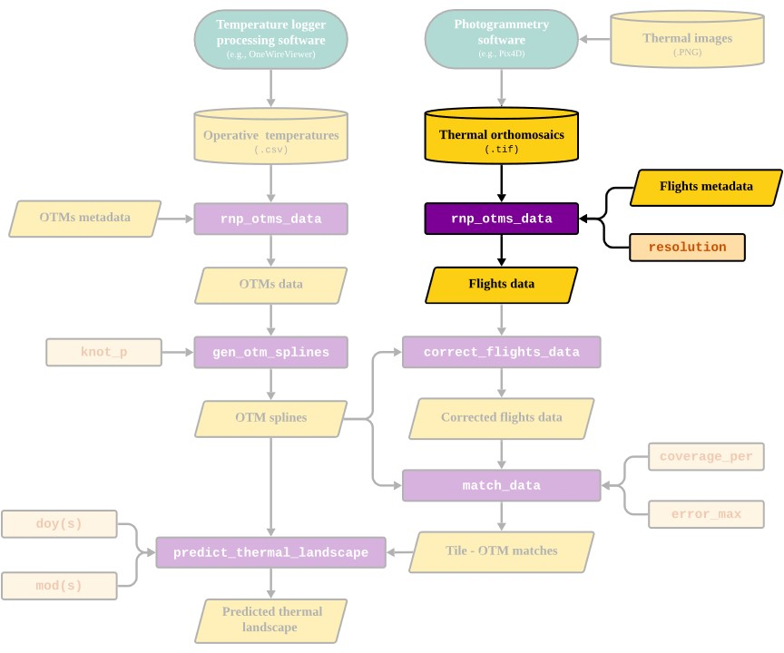
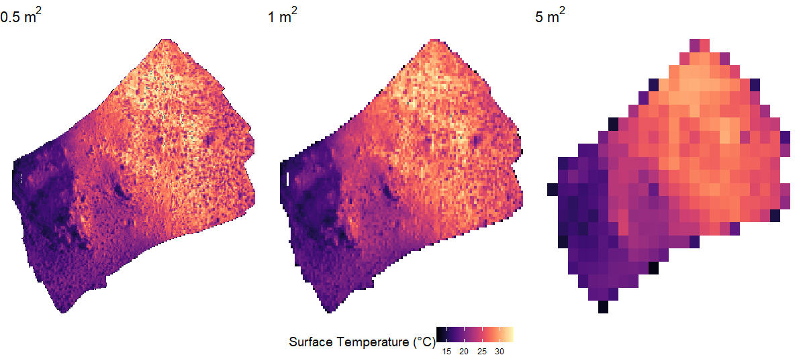

```{r setup, include=FALSE, message = FALSE}
knitr::opts_chunk$set(echo = TRUE)
devtools::load_all()
#library(throne)
library(ggplot2)
library(dplyr)
library(viridis)
library(forcats)
```

# Overview

The goal of this vignette is to illustrate the process behind the `rnp_flights_data` (**r**ead a**n**d **p**rocess flights data) function of the `throne` package. This function enables processing of raw `.tif` files obtained by combining images collected during a drone flight (see the [Flying drones and obtaining thermal orthomosaics vignette](https://ggcostoya.github.io/throne/articles/drone_setup.html)) into a data frame structure easily manageable in `R`. This data frame will later be related to operative temperature model (**OTM**) data to finally predict thermal landscapes. Below, we highlight the section of the package's workflow that is covered in this vignette:

```{r show workflow image, echo=FALSE, out.width = '100%', fig.align = 'center'}

```

Next, we present how the `rnp_flights_data` function works by discussing it's inputs, processes and output

# Inputs

The `rnp_flights_data` takes in 3 inputs:

1.  The **`path`** to the directory where all thermal orthomosaics (i.e., `.tif` files) for flights are stored.

2.  A `data.frame` with **`metadata`** for each flight. This `data.frame` must contain specific columns indicating the `flight_id`, the `date` when the flight took place and the times at which the flight started and ended. For more specific information please check the function's documentation [here](https://ggcostoya.github.io/throne/reference/rnp_flights_data.html). Below is an example data set included with `throne` illustrating how the `metadata` should be structured:

```{r show head of flights_metadata, echo = FALSE}
flights_metadata
```

3. The spatial `resolution` to which the `.tif` files should be summarized to in $m^2$. This parameter will control the spatial resolution of the final output and should be chosen according to the spatial scale of the study organism. The lower boundry for spatial resolution is set to $0.5 m^2$ and while there is no upper boundry we recommend users to set `resolution` to a value that is not larger than the area they are studying. 

# Processes

To transform the original `.tif` files, the `rnp_flights_data` goes through the following steps for all `.tif` files specified:

1.  Read each specified `.tif` file as a as a raster object using the `rast` function from the [`terra`](https://rspatial.org/pkg/) package.

2. Re-scale the resolution of the raster object to the desired spatial `resolution` using `terra`'s `aggregate` function.

3. Transform the raster object into a `data.frame`.

4. Add metadata information, including the `year`, day of the year (`doy`) and minute of the day when the flight started (`mod_start`) and ended (`mod_end`). 

> **NOTE**: Working `doy` and `mod` allows the user to work with numeric colums. This simplifies the management of the data, as dates and times have unique data formats in the `R` environment that are often difficult to handle and may lead unintended errors. Nonetheless, these formats can be  transformed back into more  interpretable temporal scales for visualization purposes, [by using the `as.Date` function to transform `doy` (also known as Julian date) back into a YYYY-MM-DD format](https://stackoverflow.com/questions/24200014/convert-day-of-year-to-date) and dividing by 60 for `mod` to get hours.

# Output

The final output of `rnp_flights_data` is a `data.frame` with the following columns:

- `x` and `y`: [UTM coordinates](https://en.wikipedia.org/wiki/Universal_Transverse_Mercator_coordinate_system).
- `year`, `doy`, `mod_start`, `mod_end`: The year, day of the year, minute of the day when the flight started and ended respectively.
- `surf_temp`: Surface IR-measured temperature (°C).

Thus, each row on the `data.frame` will correspond to a unique `surf_temp` measurement on a particular `tile` (a unique `x` and `y` combination) within a specific flight. The number of rows will in turn depend on 1) the number of flights processed and 2) the desired spatial `resolution`. 

Below is an example data set showing how the output of `rnp_flights_data` should look like:

```{r show head of the flights_data, echo = FALSE, warnings = FALSE}
head(flights_data)
```

These data can already be processed to visualize and quantify the thermal characteristics of a study site. Below we illustrate how to visualize this data using `ggplot2` and 4 of the 10 fully processed flights (with a spatial `resolution` of $1m^2$) we include in the `flights_data` example data set that is included with `throne`. Panel titles indicate the hour in which the flight took place.

```{r plot example flight data, message = FALSE, fig.width = 7, fig.height = 7, fig.align='center'}
flights_data |>
  filter(mod_start %in% c(515, 680, 926, 1051)) |>
  filter(surf_temp > 12) |>
  mutate(hour = round(mod_start/60)) |>
  mutate(hour = paste(hour,":00 h", sep = "")) |>
  ggplot(aes(x = x, y = y, fill = surf_temp)) +
  geom_raster() +
  scale_fill_viridis("Surface temperature (°C)", option = "magma") +
  facet_wrap(~ fct_reorder(hour, mod_start)) +
  xlab("Longitude") + ylab("Latitude") +
  theme_void() +
  theme(strip.text = element_text(size = 12),
        legend.position = "top")
```

# Choosing the appropriate spatial resolution

The `rnp_flights_data` function allows the user to specify the spatial `resolution` to which the `.tif` files should be summarized to. This parameter controls the spatial resolution of the final output and should be chosen according to the spatial scale of the study organism. We leave it up to the user to determine the appropriate spatial resolution for their system but we consider it important to highlight that a greater `resolution` will result in a longer processing time in all subsequent steps. To choose the appropriate resolution for their data, we recommend that users run `rnp_flights_data` at multiple spatial resolutions and visualize the output. Below is a plot illustrating one of the flights we include in `throne` as an example processed at 0.5, 1 and 5 $m^2$ of spatial resolution:

```{r plot flights at different spatial resolutions, echo=FALSE, out.width = '100%', fig.align = 'center'}

```

Next, we will present how the `throne` package can read and process OTM data and generate OTM and date specific spline models.

# BONUS: Extending the use of `throne`.

While ``throne` was designed with drone imagery in mind, users of the package can use any geo-referenced spatial raster that is encoded as a `.tif` file as a source. A potential avenue to extend the use of `throne` is to use satellite thermal imagery as that provided in the [VIIRS](https://ladsweb.modaps.eosdis.nasa.gov/missions-and-measurements/viirs/), [MODIS](https://lpdaac.usgs.gov/products/mod11a1v006/) or [Copernicus](https://climate.copernicus.eu/surface-air-temperature-maps) datasets instead of data from drone flights. Satellite rasters can be treated similarly to drone flights, though each cell will have a much coarser spatial resolution. While this approach is totally possible, users of `throne` will face a new logistical challenge in the deployment of OTMs. The recommendations provided in the “Collect OTM data” vignette would need to be adapted to a much larger study area. Users would need to deploy OTMs over a large geographical area making sure that representative microhabitats as well as any latitudinal, elevational or other environmental gradients are captured by OTMs. This would allow users to model spatio-temporally complete operative thermal landscapes at much greater scales at the expense of spatial resolution.

<nav aria-label="Page navigation">
 <ul class="pagination justify-content-end">
  <li class="page-item"><a class="page-link" href="collect_otm_data">Previous: Collect OTM data</a></li>
  <li class="page-item"><a class="page-link" href="rnp_otms_data_gen_otm_splines.html">Next: Read and process OTM data and Generate OTM splines</a></li>
 </ul>
</nav>

