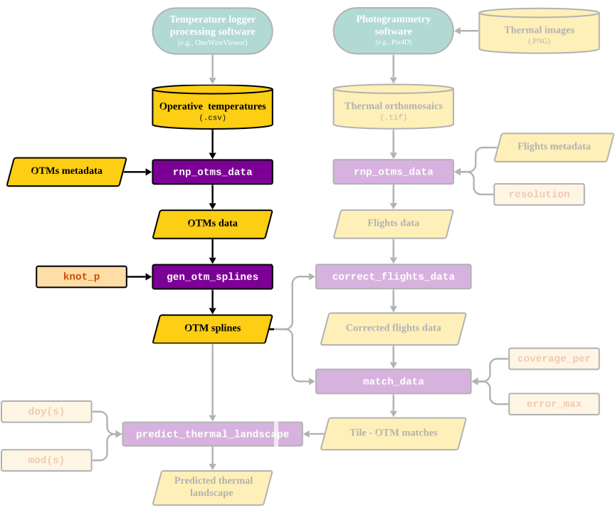

```{r setup, include=FALSE}
knitr::opts_chunk$set(echo = TRUE)
devtools::load_all()
```

# Overview

The goal of this vignette is to illustrate the process behind the `rnp_otms_data` (**r**ead a**n**d **p**rocess OTMs data) and `gen_otm_splines` (**gen**erate **OTM** **spline** model**s**) function of the `throne` package. The first function allows the user to read one or multiple raw `.csv` (see the ["Collecting OTM data vignette"](https://ggcostoya.github.io/throne/articles/otm_setup.html)with temperature measurements recorded by an temperature logger inside of an **operative temperature model** (**OTM**) to a `data.frame`-like structure  in `R`. The second function takes this processed OTM data and generates an OTM & day of year (`doy`) specific cubic spline model that describes the thermal dynamics of each unique OTM each day. These spline models will later be used to both [correct the flights data](https://ggcostoya.github.io/throne/articles/correcting_flights_data.html) and to ultimately [predict thermal landscapes](https://ggcostoya.github.io/throne/articles/predicting_thermal_landscapes.html). Below, we highlight the section of the package's workflow that is covered in this vignette:

```{r, echo=FALSE, out.width = '80%', fig.align = 'center'}

```

# Reading and processing OTMs data

The `rnp_otms_data` function reads a database of `.csv` files, reads, manipulates and ultimately combines them into a large data-frame like structure in `R`, a [`tibble`](https://tibble.tidyverse.org/). To do so, the function takes in the following inputs:

1.  The **`path`**, or directory to one or multiple `.csv` files are stored. Each of these `.csv` files is assumed to have at least:

a)  A column for operative temperature measurements. Since different temperature logger processing software structure the outputs differently in the resulting `.csv` file, we require the user to specify the column where the OTM measurements can be found in the `op_temp_col` argument of the function. In our case, we used [OneWire Viewer](https://www.analog.com/en/resources/evaluation-hardware-and-software/1-wire-sdks/viewer.html) which returns the operative temperature in the `3`rd column.

b)  A column for dates. As with the operative temperature values, we also require the user to specify the `date_col` in their .csv files. OneWireViewer returns the date in the first column in MM/DD/YY HH:MM:SS AM/PM format. By default dates and times will be extracted from this column but other software return date and time in separate columns. If that is the case, the user can specify the `time_col` as an argument of the function.

```{r, echo = FALSE}
head(good_read_otm)
```

2.  An OTM **`metadata`** `tibble` containing information related to each specific OTM (identified by a unique `otm_id`). The user can include any metadata for the OTM but we require that an `otm_id` column is present and we strongly recommend that the metadata `tibble` file also contains columns for the `latitude` and `longitude` at which the OTM was deployed. In the example metadata `tibble` that can be found in this package we also incorporate information on the `microhabitat`, `orientation` and `elevation` at which the OTM was deployed.

```{r}
otms_metadata
```

> **TIP**: We recommend that users of the `throne` package become very familiar with the formatting of the `.csv` that contain OTM data. In some software options the resulting `.csv` file will contain several rows of metadata that might lead to an incorrect reading of the file (see example below). While the `rnp_otms_data` will provide warnings we also recommend the users to specify how many rows should be skeeped when reading the `.csv` file via the `rows_skip`. Specifying the `rows_skip` argument correctly is crucial for the rest of the package's functions to work properly down the line.

```{r, echo = FALSE}
head(bad_read_otm)
```

To transform the raw `.csv` data into an `R` `tibble`, the `rnp_otm_data` function will go through the following general steps:

1.  Read each `.csv` file while skipping as many rows as specified within the `rows_skip` argument.
2.  Select the columns for time and operative temperature as specified by the `date_col` (and/or `time_col`) and `op_temp_col` arguments.
3.  Using tools from the `lubridate` package, extract the `year`, day of the year (`doy)` and minute of the day (`doy`) at which each oprative temperature measurement (`op_temp`) was made.

> **NOTE**: We choose working with `doy` and `mod` to simplify the management of the data as much as possible. Date and time data have unique data formats in the `R` environment that are often difficult to handle for users and that might lead to unintended errors. By using `doy` and `mod`, the user deals with integer columns, much easier to operate with and manipulate. Further, these formats can be easily transformed back into more easily interpretable scales for visualization purposes, [by using the `as.Date` function to transform `doy` (also known as Julian date) back into a YYYY-MM-DD format](https://stackoverflow.com/questions/24200014/convert-day-of-year-to-date) and dividing by 60 for `mod` to get hours.

4.  Merge the processed data for each OTM with its corresponding metadata and, if more than one file is specified, bind the outputs together.

The final output is a `tibble` object that should look like this:

```{r, echo = FALSE}
as_tibble(otms_data)
```

Each row on this `tibble` will correspond to a unique operative temperature (`op_temp`) measurement by a given `otm_id` in a given `year`, `doy` and `mod`. Our example data set contains measurements of 33 OTMs over 4 days recording at a rate of 720 observations / day (30 observations / h, 0.5 observations / min).

# Generating OTM spline models

Once the OTM data has been read and processed, the next step is to fit a **cubic smoothing spline model** to each individual OTM for each `doy` during it's deployment in the field. This spline model will capture the thermal dynamics of an OTM throughout a given `doy` allowing us to build a predict the operative temperature experienced by the OTM at any moment of that `doy` based on the measurements it recorded. 

To fit these models the `throne` package includes the `gen_otm_splines` function which takes as input data generated via the previously presented `rnp_otms_data` function and a  The function will return a "complex" `tibble` will include the OTM identification (`otm_id`) and all associated metadata, together with a [nested column](https://tidyr.tidyverse.org/articles/nest.html) containing the spline model generated via the native `R` function `smooth.spline`. We call this a "complex" `tibble` precisely because of the nesting of the `splines` column. The resulting splines `tibble` will contain as many rows as combinations of unique `otm_id` and `doy` since there will be a spline model for each OTM every day it was deployed in the field:

```{r, echo = FALSE}
otms_splines
```

# Choosing the appropriate `knot_p` value. 

A critical point for the `gen_otm_splines` function to work correctly is determining the appropriate value for the `knot_p` argument. This argument determines the percentage of observations recorded by an OTM in a given day that are used to determine the number of knots of the smoothing spline model. To put it simply, the number of knots will ultimately determine the degrees of freedom of the model as $df = degree + k$ and $degree = 3$ for cubic splines. (see [here](https://stats.stackexchange.com/questions/517375/splines-relationship-of-knots-degree-and-degrees-of-freedom#:~:text=In%20essence%2C%20splines%20are%20piecewise,degree%203%20and%20so%20on.) for further details). The number of degrees of freedom will then determine the "wiggliness" of the resulting model, in other words, the number of times the resulting curve will change direction. As an example, below we plot different spline models for the same data using different `knot_p` parameter specifications.

```{r, echo = FALSE, message=FALSE, fig.width=6, fig.height = 4, fig.align='center'}
# filter specific otm id data
otm_data_id <- otms_data %>% filter(otm_id == "OTM01", doy == 237)

# generate OTM splines
otm_splines_96 <- gen_otm_splines(otm_data = otm_data_id, knot_p = 96/720)
otm_splines_48 <- gen_otm_splines(otm_data = otm_data_id, knot_p = 48/720)
otm_splines_12 <- gen_otm_splines(otm_data = otm_data_id, knot_p = 12/720)
otm_splines_6 <- gen_otm_splines(otm_data = otm_data_id, knot_p = 6/720)

# generate data
otm_splines_96 <- as.data.frame(predict(otm_splines_96$spline[[1]])) %>%
  rename(mod = x, op_temp = y) %>% mutate(knot_p = 96/720)
otm_splines_48 <- as.data.frame(predict(otm_splines_48$spline[[1]])) %>%
  rename(mod = x, op_temp = y) %>% mutate(knot_p = 48/720)
otm_splines_12 <- as.data.frame(predict(otm_splines_12$spline[[1]])) %>%
  rename(mod = x, op_temp = y) %>% mutate(knot_p = 12/720)
otm_splines_6 <- as.data.frame(predict(otm_splines_6$spline[[1]])) %>%
  rename(mod = x, op_temp = y) %>% mutate(knot_p = 6/720)
otm_pred <- rbind(otm_splines_96, otm_splines_48, otm_splines_12, otm_splines_6)

# plot
ggplot() +
  geom_point(data = otm_data_id, aes(x = mod/60, y = op_temp), size = 3, alpha = 0.1) +
  geom_line(data = otm_pred, aes(x = mod/60, y = op_temp, col = as.factor(round(knot_p, digits = 3))),
            alpha = 0.75, linewidth = 1.25) +
  scale_x_continuous(expand = c(0,0)) +
  xlab("Hour of the day") +
  ylab("Operative Temperature (°C)") +
  theme_minimal() +
  theme(panel.border = element_rect(linewidth = 0.5, fill = NA),
        strip.background = element_rect(linewidth = 0.5, fill = "lightgray"),
        strip.text = element_text(size = 12)) +
  guides(color = guide_legend(title = "knot_p")) +
  ggtitle("OTM01 on DOY 237 (August 25th)")
```

The decision on which `knot_p` value to use is dependent on two things. First is the **frequency at which the OTM itself is recording**. We can extrapolate how many knots/day (or knots/h) we would get based on the frequency of recordings and the `knot_p` value according to the formula:

$$ Knot/h = Recordings/h \cdot knot_p$$

For instance, the OTMs we used here were programmed to record a temperature measurement every 2 minutes, leading to a total of 30 observations / hour. Assuming a `knot_p = 0.1` that would indicate that our model has 3 knots / h.

The second issue that determines the value of `knot_p` is the study organism of the user of this `R` package. Generally OTMs will equilibrate to the environmental temperature much faster than the organism they represent with this difference in equilibration time being positively correlated to the mass of the organism due to thermal inertia. In other words, the body temperature of an organism that has a lot of thermal inertia will not be exactly that of the OTM.

(Need some more work on this)


